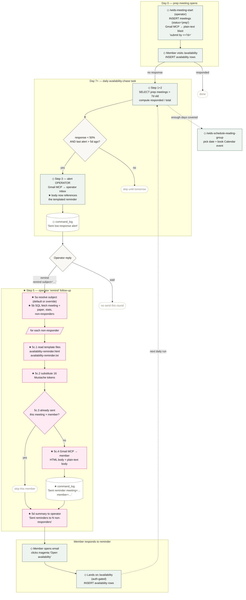

# Availability Reminder Email — flow

End-to-end lifecycle of the WiDS NYC availability-reminder pipeline,
showing where the new email template
(`assets/emails/template/availability-reminder.{html,txt}`) and the new
`availability-chase` Step 5 plug into the existing operator-driven send
flow.

- ★ = new / changed in this PR
- ◇ = pre-existing infrastructure

## Flow

## Components touched

| Component | Role | Status |
|---|---|---|
| `/wids-meeting-start` (slash command) | sends Day-0 initial availability blast | ◇ pre-existing |
| `web/app/availability/page.tsx` | portal page where members submit days | ◇ pre-existing |
| `scheduled_tasks/availability-chase.md` Steps 1–4 | daily low-response alert to operator | ◇ pre-existing |
| `scheduled_tasks/availability-chase.md` Step 5 | per-recipient render + send | ★ new |
| `assets/emails/template/availability-reminder.html` | high-fidelity templated reminder | ★ new |
| `assets/emails/template/availability-reminder.txt` | plain-text alternative | ★ new |
| `command_log` | idempotency keys (`meeting=X`, `member=Y`) | ◇ used / ★ new write site |
| Gmail MCP | actual SMTP send | ◇ pre-existing |
| `meetings`, `members`, `availability`, `papers` | merge-data sources | ◇ pre-existing |

## Why operator-in-the-loop

The scheduled task **never auto-emails members**. It always alerts the
operator first; the operator approves with `remind` (or
`remind subject="…"`) to authorise the send. This mirrors the existing
`availability-chase` design and prevents the bot from speaking with
Michelle's voice without her consent.

## Idempotency

Step 5c.3's `command_log LIKE '%reminder meeting=<id> member=<id>%'` check
guarantees that re-running Step 5 — including partial-failure retries
mid-loop — never double-sends a reminder to the same person for the same
meeting. Each successful send writes a row keyed by `meeting × member`.
