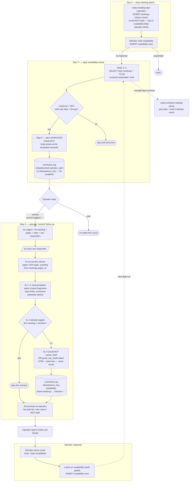

# Availability Reminder Email — flow

End-to-end lifecycle of the WiDS NYC availability-reminder pipeline:
Day-0 prep opens, the daily `availability-chase` operator alert, and the
operator-approved per-member reminder drafts from
`assets/emails/template/availability-reminder.{html,txt}`.

Operational steps live in
[`scheduled_tasks/availability-chase.md`](../scheduled_tasks/availability-chase.md).
Template matrix and token contracts live in
[`docs/runbooks/transactional-emails.md`](runbooks/transactional-emails.md).
Mark / sanitisation evidence lives in
[`docs/runbooks/email-client-behavior.md`](runbooks/email-client-behavior.md).
Raw-MIME drafting (keeps the mark) lives in
[`docs/runbooks/gmail-raw-drafts.md`](runbooks/gmail-raw-drafts.md).

For a brand-new member mid-cycle, use
[`docs/welcome-availability-flow.md`](welcome-availability-flow.md) instead —
the reminder lede ("It's been too long") is for a lapsed regular.

## Intent

A `prep` meeting has been open more than a week and fewer than half of active
members have submitted availability. The daily task **never mails members on
its own**. It alerts the operator; only a `remind` reply authorises per-member
**drafts**. The operator opens Gmail Drafts and presses Send.

## Flow



## Components

| Component | Role |
|---|---|
| `/wids-meeting-start` | Opens `prep`; Day-0 availability notification (Gmail MCP draft; operator sends) |
| `web/app/availability/page.tsx` | Portal where members submit days |
| `scheduled_tasks/availability-chase.md` Steps 1–4 | Daily low-response alert to the operator (5-day cooldown via `metadata`) |
| `scheduled_tasks/availability-chase.md` Step 5 | Per-recipient render + **draft** after `remind` |
| `assets/emails/template/availability-reminder.{html,txt}` | Templated reminder; `paper` / `paper_pending` block pair |
| `scripts/render_email_previews.py` | Shared `resolve_blocks()`, `splice_shared_blocks()`, `strip_html_comments()`, `render_pair()`; previews both states |
| `scripts/gmail_raw_drafts.py` | Optional raw-MIME path that keeps the WiDS mark (`reminder-manifest` + `batch`) |
| `command_log` | Member-draft dedupe via exact `idempotency_key`; operator alerts use `metadata` only |
| Gmail MCP `create_draft` | Default draft path — strips images/styles at creation (verified 2026-09-02) |

## Paper vs Paper-Pal-coming-soon

`availability-reminder` ships in exactly one of two states, frozen **before**
token substitution by `resolve_blocks()` (same helper
`welcome_availability.compose()` uses):

| `meetings.paper_id` | Blocks kept | What the member sees |
|---|---|---|
| set | `paper=True`, `paper_pending=False` | Paper card, "Skim the paper first", Paper Pal PS |
| `NULL` | `paper=False`, `paper_pending=True` | "Paper Pal coming soon" card + PS; **no** `paper.*` or `links.companionPreview` tokens |

A reading_group in `prep` whose leader has not chosen yet (for example the
September cycle) must use the pending state — the with-paper card would
otherwise reference tokens that do not exist. Preview both:

```sh
uv run python -m scripts.render_email_previews
# writes availability-reminder_rendered.* and
# availability-reminder--paper-pending_rendered.*
```

`render_pair()` refuses to ship a body that still contains a block marker.
JSON keys: `availability_reminder` and `availability_reminder_paper_pending`.

## Delivery is by draft, not by send

Standing policy (`transactional-emails.md`): nothing in this repo sends as the
operator. Step 5c.4 creates one Gmail **draft** per non-responder (HTML +
plain-text). The operator presses Send.

Two drafting paths:

1. **Gmail MCP `create_draft`** — what the chase prompt can drive from the
   agent. Sanitises at draft creation: no mark, no `<style>` / `<svg>` /
   classes / Outlook conditionals; hrefs rewritten. Table layout and copy
   survive. Tell the operator the mark is absent.
2. **`scripts/gmail_raw_drafts.py`** — operator's machine, own OAuth. Stores
   MIME verbatim (default `cid` mark). Agent hands over `recipients.json` +
   `tokens.json` and the `reminder-manifest` / `batch` commands. Still drafts
   only; a test fails if a send path is added. Setup:
   [`docs/runbooks/gmail-raw-drafts.md`](runbooks/gmail-raw-drafts.md).

Do not log the chase idempotency key for an unsent draft — that silences the
chase for a member who never got mail (same rule as welcome).

## Why operator-in-the-loop

The scheduled task never auto-emails members. It always alerts the operator
first; the operator approves with `remind` (or `remind subject="…"`) to
authorise drafts. That keeps Michelle's voice off the wire without consent.

## Idempotency

Step 5c.3 checks the exact key

```text
availability-chase:meeting=<meeting_id>:member=<member_id>
```

before drafting. Each successful draft write uses the same key;
`command_log_idempotency_key_unique` (migration `020`) is the race backstop.
SQLSTATE `23505` → treat as already drafted and continue.

Operator alerts deliberately **do not** use `idempotency_key`. They key on
`metadata.kind = 'operator_alert'` + `metadata.meeting_id` with a 5-day
`MAX(ran_at)` cooldown so the alert can re-fire while the meeting stays
under-responded.

Do not use `summary LIKE` scans. See
[`docs/runbooks/transactional-emails.md`](runbooks/transactional-emails.md)
for the full template and idempotency map.

## Preview and tests

```sh
uv run python -m scripts.render_email_previews
uv run pytest -c tests/pytest.ini -v \
  tests/render_email_previews_test.py \
  tests/gmail_raw_drafts_test.py
```
