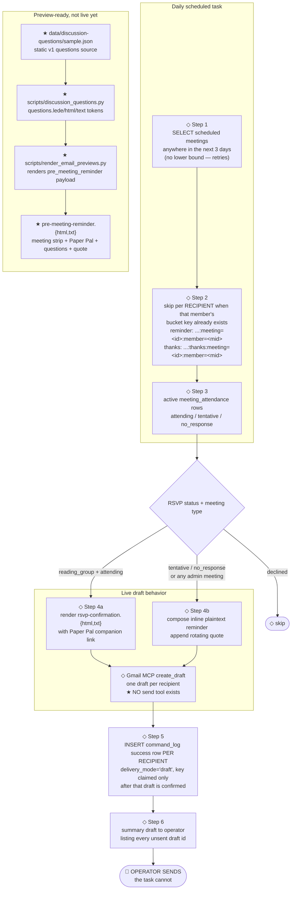

# Pre-meeting reminder email — flow

Current operator-facing lifecycle for the WiDS NYC pre-meeting reminder,
including the split between the live scheduled task and the newer
preview-ready template pair in
`assets/emails/template/pre-meeting-reminder.{html,txt}`.

- ◇ = currently live in `scheduled_tasks/pre-meeting-reminder.md`
- ★ = template/preview infrastructure exists, but is not wired into the live send

## Flow



## Components

| Component | Role | Status |
|---|---|---|
| `scheduled_tasks/pre-meeting-reminder.md` | Daily task prompt that selects meetings, splits recipients, **drafts** email, logs per-recipient idempotency, and hands the send to the operator | ◇ live |
| `assets/emails/template/rsvp-confirmation.{html,txt}` | Multipart thank-you for reading-group members who RSVP'd `attending` | ◇ live through Step 4a |
| Inline Step 4b body | Plain reminder for `tentative` / `no_response` members and for admin meetings | ◇ live |
| `scripts/quotes.py` + `data/quotes/` | Deterministic women-in-STEM quote rotation; `date_key` is whole UTC days since 1970-01-01 | ◇ live in both send branches |
| `assets/emails/template/pre-meeting-reminder.{html,txt}` | High-fidelity reminder with meeting details, Paper Pal, discussion questions, and quote | ★ preview-ready only |
| `data/discussion-questions/sample.json` | Static eight-question v1 source for preview rendering | ★ preview-ready only |
| `scripts/discussion_questions.py` | Validates questions and composes flat Mustache tokens for HTML/TXT templates | ★ preview-ready only |
| `scripts/render_email_previews.py` | Renders `*_rendered.html` / `*_rendered.txt` files and emits Gmail-MCP-ready JSON | ★ preview-ready only |

## Current live behavior

### Delivery is by draft, not by send

The Gmail MCP has no send tool — `create_draft` / `update_draft` only. This task
composes each email and leaves it in the operator's Drafts folder; **the
operator sends**. A created draft is logged `status='success'` with
`metadata.delivery_mode='draft'`.

Until 2026-08-12 the spec said "Send via Gmail MCP", which was unfollowable. The
2026-08-11 run for meeting 37 rendered all 8 emails, could only draft them,
logged `failure` with `emails_sent=0`, and still claimed the meeting's
idempotency key — so the meeting could never be retried, and 8 members were
never reminded about a meeting 2 days away. The three fixes below all trace to
that run.

### Window has no lower bound

`pre-meeting-reminder` runs once per day and handles meetings with
`status='scheduled'` whose `scheduled_at` is in the future and less than 3 days
away. The old `[2 days, 3 days)` window gave each meeting exactly one run inside
it — one chance, no retry — and a meeting that fell out of the window between
runs was unreachable forever. The happy path is unchanged (a meeting is still
first caught 2–3 days out); the change adds retries at roughly 41h and 17h.

### Idempotency is per recipient

Step 2 uses two disjoint key shapes, mirroring `availability-chase` Step 5c:

```text
pre-meeting-reminder:meeting=<id>:member=<mid>          -- plain reminder
pre-meeting-reminder:thanks:meeting=<id>:member=<mid>   -- RSVP thank-you
```

A key is claimed **only after that recipient's draft is confirmed created**.
Every other outcome — venue hold, `create_draft` error, unresolved token —
writes a keyless row, so the next daily run retries exactly the recipients it
missed and no others. The unique index on `command_log.idempotency_key` is the
race backstop for overlapping runs.

A legacy guard on the old meeting-level key `pre-meeting-reminder:meeting=<id>`
skips any meeting handled under the pre-cutover scheme; without it, meeting 37's
8 existing drafts would be duplicated. Remove it after 2026-09-30.

Recipients come from active `meeting_attendance` rows:

- `attending` reading-group members receive `rsvp-confirmation.{html,txt}`.
- `tentative` and `no_response` members receive the inline plaintext reminder.
- Admin meetings use the inline plaintext branch for everyone in scope.
- `declined` members are skipped.

The live plaintext reading-group branch now links the Paper Pal companion
instead of telling members to ask the leader for a "discussion guide" — that
flow is deprecated. The line is omitted when `papers.companion_url IS NULL`.

## Previewing the new template

Use the preview renderer when changing email templates, quotes, or the static
discussion-question source:

```sh
uv run python -m scripts.render_email_previews
```

The command writes rendered files next to each template, including:

- `assets/emails/template/pre-meeting-reminder_rendered.html`
- `assets/emails/template/pre-meeting-reminder_rendered.txt`

It also prints a JSON payload with a `pre_meeting_reminder` object containing
`html` and `text` bodies for Gmail-MCP draft creation. The preview renderer
fails on unresolved Mustache tokens, so broken template data is caught before an
operator copies a draft.

## Discussion-question constraints

`data/discussion-questions/sample.json` is intentionally a v1 seam, not the
source of truth for every paper. The current loader requires:

- a top-level JSON object with a non-empty `questions` array;
- every entry to be a non-empty string;
- no template logic in the email files.

`scripts/discussion_questions.py` composes three flat tokens:

- `questions.lede` — count-aware copy such as `Eight to chew on ...`;
- `questions.html` — email-safe table rows with zero-padded numbers;
- `questions.text` — a plain numbered list for the TXT alternative.

When a per-paper question source exists, repoint the loader/source seam before
wiring the template into the live scheduled task.

## Cutover checklist

Before replacing Step 4b with `pre-meeting-reminder.{html,txt}`:

1. Decide the recipient policy: only `tentative` / `no_response`, or all
   reading-group invitees including members already marked `attending`.
2. ~~Replace the legacy "discussion guide" copy with Paper Pal links~~ — **done
   2026-08-12.** Step 4b links `paper.companionUrl` and omits the line when
   `companion_url IS NULL`.
3. Provide a real per-paper discussion-question source or an operator-curated
   fallback; do not rely on the sample questions for production sends.
4. ~~Keep the existing meeting-level idempotency key unless the send semantics
   change to per-recipient retries~~ — **superseded 2026-08-12.** The semantics
   did change. Keys are now per recipient (`…:meeting=<id>:member=<mid>` and the
   disjoint `…:thanks:…` variant), claimed only after a draft is confirmed
   created. Keep that; do not reintroduce a meeting-level key.
5. Preserve the Step 6 operator handoff. The template cutover changes what the
   drafts look like, not the fact that a human still has to send them.
6. Run the focused tests:

   ```sh
   uv run pytest tests/discussion_questions_test.py tests/render_email_previews_test.py -v
   ```

