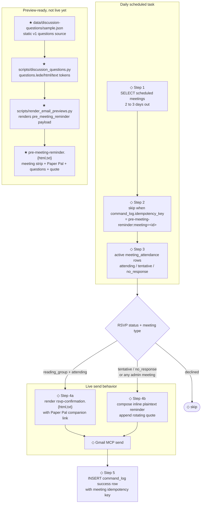

# Pre-meeting reminder email — flow

Current operator-facing lifecycle for the WiDS NYC pre-meeting reminder,
including the split between the live scheduled task and the newer
preview-ready template pair in
`assets/emails/template/pre-meeting-reminder.{html,txt}`.

- ◇ = currently live in `scheduled_tasks/pre-meeting-reminder.md`
- ★ = template/preview infrastructure exists, but is not wired into the live send

## Flow



## Components

| Component | Role | Status |
|---|---|---|
| `scheduled_tasks/pre-meeting-reminder.md` | Daily task prompt that selects meetings, splits recipients, sends email, and logs idempotency | ◇ live |
| `assets/emails/template/rsvp-confirmation.{html,txt}` | Multipart thank-you for reading-group members who RSVP'd `attending` | ◇ live through Step 4a |
| Inline Step 4b body | Plain reminder for `tentative` / `no_response` members and for admin meetings | ◇ live |
| `scripts/quotes.py` + `data/quotes/` | Deterministic women-in-STEM quote rotation; `date_key` is whole UTC days since 1970-01-01 | ◇ live in both send branches |
| `assets/emails/template/pre-meeting-reminder.{html,txt}` | High-fidelity reminder with meeting details, Paper Pal, discussion questions, and quote | ★ preview-ready only |
| `data/discussion-questions/sample.json` | Static eight-question v1 source for preview rendering | ★ preview-ready only |
| `scripts/discussion_questions.py` | Validates questions and composes flat Mustache tokens for HTML/TXT templates | ★ preview-ready only |
| `scripts/render_email_previews.py` | Renders `*_rendered.html` / `*_rendered.txt` files and emits Gmail-MCP-ready JSON | ★ preview-ready only |

## Current live behavior

`pre-meeting-reminder` runs once per day and handles meetings with
`status='scheduled'` whose `scheduled_at` is at least 2 days and less than
3 days away. Step 2 uses this idempotency key:

```text
pre-meeting-reminder:meeting=<id>
```

If the key already exists in `command_log`, the task skips that meeting. Step 5
writes the same key after a successful send, and the unique index on
`command_log.idempotency_key` is the race backstop for overlapping runs.

Recipients come from active `meeting_attendance` rows:

- `attending` reading-group members receive `rsvp-confirmation.{html,txt}`.
- `tentative` and `no_response` members receive the inline plaintext reminder.
- Admin meetings use the inline plaintext branch for everyone in scope.
- `declined` members are skipped.

The live plaintext reading-group branch still says to ask the leader for a
"discussion guide." Treat that as legacy copy until Step 4b is rewired to the
new template and Paper Pal source.

## Previewing the new template

Use the preview renderer when changing email templates, quotes, or the static
discussion-question source:

```sh
uv run python -m scripts.render_email_previews
```

The command writes rendered files next to each template, including:

- `assets/emails/template/pre-meeting-reminder_rendered.html`
- `assets/emails/template/pre-meeting-reminder_rendered.txt`

It also prints a JSON payload with a `pre_meeting_reminder` object containing
`html` and `text` bodies for Gmail-MCP draft creation. The preview renderer
fails on unresolved Mustache tokens, so broken template data is caught before an
operator copies a draft.

## Discussion-question constraints

`data/discussion-questions/sample.json` is intentionally a v1 seam, not the
source of truth for every paper. The current loader requires:

- a top-level JSON object with a non-empty `questions` array;
- every entry to be a non-empty string;
- no template logic in the email files.

`scripts/discussion_questions.py` composes three flat tokens:

- `questions.lede` — count-aware copy such as `Eight to chew on ...`;
- `questions.html` — email-safe table rows with zero-padded numbers;
- `questions.text` — a plain numbered list for the TXT alternative.

When a per-paper question source exists, repoint the loader/source seam before
wiring the template into the live scheduled task.

## Cutover checklist

Before replacing Step 4b with `pre-meeting-reminder.{html,txt}`:

1. Decide the recipient policy: only `tentative` / `no_response`, or all
   reading-group invitees including members already marked `attending`.
2. Replace the legacy "discussion guide" copy with Paper Pal links from
   `paper.companionUrl`.
3. Provide a real per-paper discussion-question source or an operator-curated
   fallback; do not rely on the sample questions for production sends.
4. Keep the existing meeting-level idempotency key unless the send semantics
   change to per-recipient retries.
5. Run the focused tests:

   ```sh
   uv run pytest tests/discussion_questions_test.py tests/render_email_previews_test.py -v
   ```

