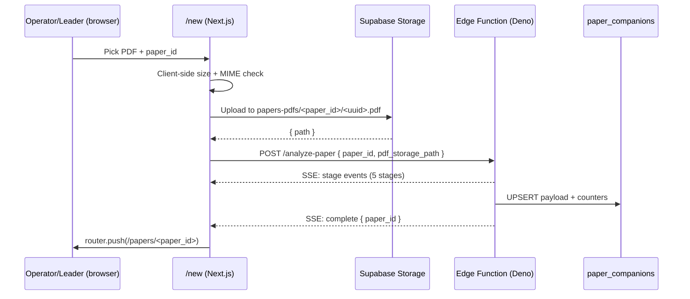

# Paper Pal — PR2 Implementation Plan

> **For agentic workers:** REQUIRED SUB-SKILL: Use `superpowers:subagent-driven-development` (recommended) or `superpowers:executing-plans` to implement this plan task-by-task. Steps use checkbox (`- [ ]`) syntax for tracking.

**Status:** ready
**Date:** 2026-05-18
**Branch:** `claude/paper-pal-pr2-inportal-wiring`
**Source spec:** [`docs/superpowers/specs/2026-05-17-paper-pal-edge-functions.md`](../specs/2026-05-17-paper-pal-edge-functions.md) §10 (PR2 slice) + §13 (wire contracts). When in doubt, the spec is authoritative.
**Predecessor:** PR1 (#51 merged) + PR1 follow-up (#52 merged). PR2 depends on the three Edge Functions, migrations 015 + 016, and the `wids-prune-paper-pdfs` scheduled task being in place on staging.
**Budget:** ~7h (per spec §12).

---

## Goal

PR1 shipped the **server side**: three Edge Functions (`analyze-paper` with stage-SSE, `analyze-hint`, `analyze-socratic`), provider abstraction, schema + RPC gate, and the bucket-prune task in dry-run.

PR2 makes everything PR1 shipped **visible in the browser**. After PR2:

1. The operator (or a paper's meeting leader) opens `/new`, uploads a PDF, watches a 5-step progress bar, and lands on `/papers/<id>` with the synthesis rendered.
2. Readers on `/papers/<id>` can hit "Need a hint?" inside `McqMode` and see a streamed-in suggestion.
3. Readers can hold a multi-turn Socratic dialog in `SocraticMode`.
4. The `wids-prune-paper-pdfs` scheduled task graduates from dry-run to live after one successful dry-run cycle.

## Non-goals (deferred to PR3)

- KaTeX math rendering (deferred at #45)
- Discussion board / spaced-repetition review (Phases 8 & 9, NEEDS SCHEMA)
- Removing `/wids-make-companion` — kept as fallback
- True token streaming (only stage-based SSE per spec §11 Q4)
- A multi-paper "in-flight syntheses" view on `/new` — confirmed PR3 scope by user 2026-05-18
- Socratic turn-history resume (we hold turns in component state only; reading from `paper_socratic_turns` is PR3)

## Architecture (PR2 slice)



`McqMode` and `SocraticMode` each `fetch()` their respective Edge Function with plain JSON request/response — **no SSE** on those two endpoints (per spec §4.2 / §4.3).

---

## File structure

### New files

- `migrations/017_papers_pdfs_bucket.sql` — Storage bucket + INSERT RLS keyed on `can_synthesize_paper_pal()`
- `web/app/new/page.tsx` — server component, fetches operator state + renders form
- `web/app/new/NewPaperForm.tsx` — client component, owns upload + SSE consumer + progress UI
- `web/lib/sse.ts` — reusable SSE frame parser (async generator over `response.body`)
- `web/lib/paperpal/hint.ts` — `fetchHint(paperId, questionId, userAnswer)` JSON client
- `web/lib/paperpal/socratic.ts` — `fetchSocratic(paperId, promptId, userResponse, turnNumber)` JSON client
- `web/lib/paperpal/types.ts` — TS types for the three endpoint payloads (mirror Edge Function shapes)
- Tests:
  - `web/lib/sse.test.ts` — frame parser, partial-frame buffering, malformed-frame handling
  - `web/app/new/NewPaperForm.test.tsx` — MSW-mocked SSE happy path, 429, 401/403, error event, oversize file
  - `web/components/paper/McqMode.test.tsx` — hint integration (added to existing tests if file exists)
  - `web/components/paper/SocraticMode.test.tsx` — 3-turn happy path, summary render, mid-turn failure
  - `tests/papers_pdfs_bucket_rls.test.ts` — RLS smoke (Supabase test client): operator + leader allowed, non-leader + anon blocked

### Modified files

- `web/components/paper/McqMode.tsx` — add "Need a hint?" button + render of `{hint, confidence}` + loading/error states
- `web/components/paper/SocraticMode.tsx` — wire submit to `fetchSocratic`, track local `turns[]`, render `next_question` / `summary`
- `scheduled_tasks/wids-prune-paper-pdfs.md` — document the dry-run → live cutover procedure (the flip itself is a `supabase secrets set`, not a code change)
- `README.md` — replace "synthesis via `/wids-make-companion`" with "in-portal `/new` upload; slash command remains as fallback"
- `web/.env.example` — add `PAPER_PAL_INPORTAL_SYNTHESIS` (defaults false in non-prod)

### Convention notes

- Web tests use Vitest + Testing Library + MSW (matches existing `web/lib/*.test.ts`).
- Edge-function-facing wire types live in `web/lib/paperpal/types.ts` so PR3 can reuse them; keep them in sync with spec §4.
- Migration uses `BEGIN; ... COMMIT;` pattern (matches `migrations/013_paper_companions.sql` and 014/015/016 from PR1).

---

## Resolved questions (confirmed by user 2026-05-18)

| # | Question | Resolution |
|---|---|---|
| Q1 | Where do we enforce the 32MB PDF size limit? | **Both** — client-side reject for fast UX, Edge Function reject as the trust boundary. Client uses `file.size > 32 * 1024 * 1024`; Edge Function asserts after fetching the signed URL. |
| Q2 | What happens to a PDF if synthesis fails after upload? | **Leave it.** The next successful regeneration overwrites by `paper_id/<uuid>` reuse, and `wids-prune-paper-pdfs` reaps the bucket on its own schedule. No compensating delete in PR2. |
| Q3 | Does `/new` show in-flight syntheses for other papers? | **No.** Single-paper flow only; multi-paper queue UI is PR3. |

---

## Slice-by-slice plan

### Slice 1 — Storage bucket + RLS (1h)

**File:** `migrations/017_papers_pdfs_bucket.sql`

```sql
BEGIN;

INSERT INTO storage.buckets (id, name, public)
  VALUES ('papers-pdfs', 'papers-pdfs', false)
  ON CONFLICT (id) DO NOTHING;

-- INSERT: caller must be owner/admin or the paper's meeting leader.
-- Object path convention is "<paper_id>/<uuid>.pdf"; we extract paper_id
-- from the path and feed it to the shared SQL gate from migration 016.
CREATE POLICY "papers_pdfs_owner_or_leader_insert"
  ON storage.objects FOR INSERT
  WITH CHECK (
    bucket_id = 'papers-pdfs'
    AND (
      can_synthesize_paper_pal(
        NULLIF(split_part(name, '/', 1), '')::bigint
      ) ->> 'canSynthesize'
    )::boolean = true
  );

-- No SELECT / UPDATE / DELETE policy: bucket is service-role-only beyond
-- this INSERT path. The Edge Function mints its own signed URLs (spec §13.4).

COMMIT;
```

`★ Insight ─────────────────────────────────────`
The `NULLIF(... , '')::bigint` cast is defensive: if a misbehaving client uploads to bucket root with no paper-id prefix, `split_part` returns `''`, `NULLIF` returns `NULL`, and `can_synthesize_paper_pal(NULL)` falls through to `canSynthesize=false`. Without it, the cast would error and surface as 500 instead of 403.
`─────────────────────────────────────────────────`

#### Tasks

- [ ] **RED** — `tests/papers_pdfs_bucket_rls.test.ts`:
  - Operator member: upload to `42/foo.pdf` → succeeds
  - Leader of paper 42: upload to `42/foo.pdf` → succeeds
  - Signed-in non-leader: upload to `42/foo.pdf` → fails (403/policy violation)
  - Anonymous: upload → fails
  - Upload to bucket root (no `<paper_id>/` prefix) → fails
- [ ] **GREEN** — apply `migrations/017_papers_pdfs_bucket.sql` against the Supabase test branch; run tests.
- [ ] Commit (RED + GREEN as separate commits per global CLAUDE.md TDD rule).

### Slice 2 — `/new` page + SSE consumer (2.5h, riskiest)

**Files:** `web/app/new/page.tsx`, `web/app/new/NewPaperForm.tsx`, `web/lib/sse.ts`, `web/lib/paperpal/types.ts`.

#### 2a. `web/lib/sse.ts` — reusable frame parser

```ts
export type SseFrame = { event: string; data: unknown };

export async function* readSseFrames(res: Response): AsyncGenerator<SseFrame> {
  if (!res.body) throw new Error("sse: response body missing");
  const reader = res.body.pipeThrough(new TextDecoderStream()).getReader();
  let buf = "";
  try {
    while (true) {
      const { done, value } = await reader.read();
      if (done) {
        const tail = buf.trim();
        if (tail) yield parseFrame(tail);
        return;
      }
      buf += value;
      const frames = buf.split("\n\n");
      buf = frames.pop()!; // Trailing partial frame stays in the buffer.
      for (const raw of frames) {
        const trimmed = raw.trim();
        if (trimmed) yield parseFrame(trimmed);
      }
    }
  } finally {
    reader.releaseLock();
  }
}

function parseFrame(raw: string): SseFrame {
  let event = "message";
  const dataLines: string[] = [];
  for (const line of raw.split("\n")) {
    if (line.startsWith("event:")) event = line.slice("event:".length).trim();
    else if (line.startsWith("data:")) dataLines.push(line.slice("data:".length).trim());
    // Ignore other SSE fields (id, retry, :comments) — not used by analyze-paper.
  }
  const joined = dataLines.join("\n");
  let data: unknown = null;
  if (joined) {
    try { data = JSON.parse(joined); } catch { data = joined; }
  }
  return { event, data };
}
```

`★ Insight ─────────────────────────────────────`
The trailing-partial-frame buffering is the bug magnet. SSE chunks can split mid-frame (e.g. `"event: stage\ndata: {\"stage\":\"par"` arrives in one read, `"sing_pdf\"}\n\n"` in the next). `buf.split("\n\n").pop()` always returns the last element, which is either the unterminated tail or an empty string after a clean boundary — both safe to keep as the next iteration's prefix.
`─────────────────────────────────────────────────`

- [ ] **RED** — `web/lib/sse.test.ts`:
  - Parses a single well-formed frame
  - Parses multiple frames in one chunk
  - **Buffers a partial frame across two `read()`s** (explicit test, splitting payload mid-token)
  - Handles `event:` lines with and without spaces
  - Multi-line `data:` values get joined with `\n`
  - Malformed JSON data yields the raw string (does not throw)
  - Empty body yields no frames
- [ ] **GREEN** — implement `web/lib/sse.ts`.
- [ ] Commit RED + GREEN.

#### 2b. `web/lib/paperpal/types.ts` — shared wire types

```ts
export type AnalyzePaperBody = { paper_id: number; pdf_storage_path: string; provider?: "gemini" | "claude" };
export type AnalyzePaperRateLimit = { error: "rate_limited"; retry_after_seconds: number };
export type AnalyzePaperStage =
  | "parsing_pdf" | "generating_synthesis" | "drafting_assessment" | "persisting";
export type AnalyzePaperStageEvent = { stage: AnalyzePaperStage; elapsed_ms: number };
export type AnalyzePaperCompleteEvent = { paper_id: number; provider: string; duration_ms: number };
export type AnalyzePaperErrorEvent = { message: string };

export type HintBody = { paper_id: number; question_id: string; user_answer: string };
export type HintResponse = { hint: string; confidence: "low" | "medium" | "high" };

export type SocraticBody = { paper_id: number; prompt_id: string; user_response: string; turn_number: number };
export type SocraticResponse = { next_question: string; summary?: string };
```

#### 2c. `NewPaperForm.tsx` — client component

Flow:

1. `<input type="file" accept="application/pdf">`. On change: reject if `file.size > 32 * 1024 * 1024` or `file.type !== "application/pdf"`. Surface inline error; keep the form populated for re-pick.
2. On submit:
   - `path = \`${paperId}/${crypto.randomUUID()}.pdf\``
   - `await supabase.storage.from("papers-pdfs").upload(path, file)` — surface RLS denial as "You don't have permission to synthesize this paper."
3. `const res = await fetch("/functions/v1/analyze-paper", { method: "POST", headers: { "Content-Type": "application/json", "Authorization": \`Bearer ${session.access_token}\` }, body: JSON.stringify({ paper_id, pdf_storage_path: path }) });`
4. Check `res.ok` **before** consuming the body:
   - `429`: read JSON, toast `Rate-limited — try again in ${retry_after_seconds}s`. Stop.
   - `401`: redirect to login.
   - `403`: toast "You can only synthesize papers you own or lead." Stop.
   - `5xx`: toast "Synthesis failed — please retry." Log to console.
5. If `ok`: drive the 5-step progress bar from `readSseFrames(res)`:
   - `stage` events → update current step + elapsed timer
   - `complete` event → `router.push(\`/papers/${data.paper_id}\`)`
   - `error` event → toast `data.message`, keep form, allow retry
6. While streaming, the submit button is disabled and shows "Synthesizing… (step X / 5)".

`★ Insight ─────────────────────────────────────`
The `Authorization: Bearer ${session.access_token}` is required because Supabase Edge Functions don't auto-attach the user JWT to `POST` requests with a JSON body the way they do for RPCs. The `can_synthesize_paper_pal()` gate inside the function reads `current_member_id()` from that header.
`─────────────────────────────────────────────────`

- [ ] **RED** — `web/app/new/NewPaperForm.test.tsx` (MSW + fake `crypto.randomUUID`):
  - Happy path: upload + SSE walks 4 `stage` events then `complete` → assert `router.push` called with `/papers/42`
  - Oversize PDF (32MB + 1B): submit blocked, inline error shown, no network call
  - Non-PDF MIME: same
  - 429: toast surfaces `retry_after_seconds`
  - 401: redirect to login
  - 403: toast surfaces permission message
  - SSE `error` event mid-stream: toast + form retained, no navigation
  - Storage upload RLS denial: maps to friendly toast
- [ ] **GREEN** — implement `NewPaperForm.tsx` + `page.tsx`.
- [ ] Commit RED + GREEN.

### Slice 3 — `McqMode` → `/analyze-hint` (1.5h)

**File:** `web/lib/paperpal/hint.ts`

```ts
import type { HintResponse } from "./types";

export async function fetchHint(
  paperId: number, questionId: string, userAnswer: string, accessToken: string,
): Promise<HintResponse> {
  const res = await fetch("/functions/v1/analyze-hint", {
    method: "POST",
    headers: { "Content-Type": "application/json", "Authorization": `Bearer ${accessToken}` },
    body: JSON.stringify({ paper_id: paperId, question_id: questionId, user_answer: userAnswer }),
  });
  if (!res.ok) {
    const err = await res.json().catch(() => ({}));
    throw new Error(err.error ?? `hint_failed_${res.status}`);
  }
  return res.json();
}
```

**File:** `web/components/paper/McqMode.tsx` (modify)

Add:

- "Need a hint?" button next to each question
- Local state per question: `{ status: "idle" | "loading" | "ready" | "error", hint?: HintResponse, error?: string }`
- Button disabled when `user_answer` is empty (spec gate: hints need an attempt)
- Confidence badge: gray (`low`), blue (`medium`), green (`high`)
- 403 → toast: "RSVP to a meeting using this paper to unlock hints"

#### Tasks

- [ ] **RED** — extend `McqMode.test.tsx`:
  - Renders hint after successful fetch; confidence badge color matches
  - Button disabled until user types something
  - 403 toasts the RSVP message
  - Network error preserves user answer
- [ ] **GREEN** — implement `fetchHint` + `McqMode` changes.
- [ ] Commit RED + GREEN.

### Slice 4 — `SocraticMode` → `/analyze-socratic` (1.5h)

**File:** `web/lib/paperpal/socratic.ts`

```ts
import type { SocraticResponse } from "./types";

export async function fetchSocratic(
  paperId: number, promptId: string, userResponse: string, turnNumber: number, accessToken: string,
): Promise<SocraticResponse> {
  const res = await fetch("/functions/v1/analyze-socratic", {
    method: "POST",
    headers: { "Content-Type": "application/json", "Authorization": `Bearer ${accessToken}` },
    body: JSON.stringify({ paper_id: paperId, prompt_id: promptId, user_response: userResponse, turn_number: turnNumber }),
  });
  if (!res.ok) {
    const err = await res.json().catch(() => ({}));
    throw new Error(err.error ?? `socratic_failed_${res.status}`);
  }
  return res.json();
}
```

**File:** `web/components/paper/SocraticMode.tsx` (modify)

```ts
type SocraticTurn = { user_response: string; ai_next_question: string };

const [turns, setTurns] = useState<SocraticTurn[]>([]);
const [summary, setSummary] = useState<string | null>(null);

async function onSubmit(userResponse: string) {
  const turnNumber = turns.length + 1;
  try {
    const result = await fetchSocratic(paperId, currentPromptId, userResponse, turnNumber, accessToken);
    setTurns(prev => [...prev, { user_response: userResponse, ai_next_question: result.next_question }]);
    if (result.summary) setSummary(result.summary);
  } catch (e) {
    toast.error("Socratic step failed — your answer is preserved; try again.");
  }
}
```

#### Tasks

- [ ] **RED** — `web/components/paper/SocraticMode.test.tsx`:
  - 3-turn happy path renders all turn pairs in order
  - `summary` field renders the wrap-up card
  - Mid-turn network failure: input retained, error toast, turns array unchanged
  - Turn-history NOT fetched from `paper_socratic_turns` (intentional — PR3 scope)
- [ ] **GREEN** — implement `fetchSocratic` + `SocraticMode` changes.
- [ ] Commit RED + GREEN.

### Slice 5 — Flip `wids-prune-paper-pdfs` dry-run → live (0.25h)

This is **not** a code change in PR2 — it's an ops step documented in the PR description, executed after merge:

1. Watch the Sunday 02:00 UTC scheduled run in `command_log` post-PR1 deploy.
2. If the dry-run output (deleted-paths preview) matches expectations, run:
   ```bash
   supabase secrets set PAPER_PAL_PRUNE_DRY_RUN=false
   ```
3. Update `scheduled_tasks/wids-prune-paper-pdfs.md` to note the flip date + commit hash.

#### Tasks

- [ ] Edit `scheduled_tasks/wids-prune-paper-pdfs.md` to document the cutover checklist (no behavior change yet).
- [ ] Add ops checklist to PR2 description.

### Slice 6 — Docs + flag flip (0.25h)

- [ ] `README.md`: replace "synthesis via `/wids-make-companion`" with the in-portal flow.
- [ ] `web/.env.example`: add `PAPER_PAL_INPORTAL_SYNTHESIS` (default `false`).
- [ ] Production env: `vercel env add PAPER_PAL_INPORTAL_SYNTHESIS=true`.
- [ ] Smoke: operator uploads one real arXiv PDF on staging; verify `/papers/<id>` renders within 90s and `paper_companions.provider = 'gemini'`.
- [ ] Backlink: edit the spec at `docs/superpowers/specs/2026-05-17-paper-pal-edge-functions.md` to add a "PR2 landed in #N" footer (after merge).

---

## TDD commit order (per global CLAUDE.md)

| # | Phase | Slice | Scope |
|---|---|---|---|
| 1 | RED | 1 | Storage RLS migration + tests |
| 2 | GREEN | 1 | Migration applied |
| 3 | RED | 2a | `web/lib/sse.ts` frame-parser tests incl. partial-frame buffering |
| 4 | GREEN | 2a | `web/lib/sse.ts` implementation |
| 5 | RED | 2c | `NewPaperForm` integration tests (MSW + mocked SSE) |
| 6 | GREEN | 2b+2c | Wire types + `NewPaperForm` + `page.tsx` |
| 7 | RED | 3 | `fetchHint` + `McqMode` tests |
| 8 | GREEN | 3 | Hint wiring |
| 9 | RED | 4 | `fetchSocratic` + `SocraticMode` tests |
| 10 | GREEN | 4 | Socratic wiring |
| 11 | DOCS | 5+6 | README + scheduled task doc + spec backlink + env flip notes |

After GREEN of each slice: confirm `ruff` (Python — Slice 1 has psql tests only, so skip if none) + `eslint`/`tsc --noEmit` (web) + full Vitest run pass before committing.

---

## Pre-PR self-review checklist (per global CLAUDE.md PR Workflow)

- [ ] Verified working dir for any `pytest`/`ruff` commands (Python tests live in `tests/`)
- [ ] SSE partial-frame test exists and **exercises split-mid-frame**
- [ ] `Retry-After` header is read from the 429 response, not hard-coded
- [ ] Client-side **and** Edge-Function-side 32MB checks are both present (Q1 resolution)
- [ ] No compensating delete on upload failure (Q2 resolution — leave the PDF)
- [ ] No multi-paper queue UI in PR2 (Q3 resolution — PR3 only)
- [ ] Bucket path validation: client uploads to `${paper_id}/<uuid>.pdf`, matches Edge Function path-prefix assertion (spec §13.4)
- [ ] **No `EventSource` anywhere** — `POST` SSE only, via `fetch()` + `readSseFrames`
- [ ] `PAPER_PAL_INPORTAL_SYNTHESIS=false` preserved as the default; flip is a documented ops step, not part of the merge
- [ ] Spec back-link added to the PR description and (post-merge) to the spec footer

## Post-merge ops checklist

- [ ] `vercel env add PAPER_PAL_INPORTAL_SYNTHESIS=true` (production)
- [ ] Run end-to-end smoke on staging: operator + leader + non-leader paths
- [ ] Wait one cycle of `wids-prune-paper-pdfs` dry-run; review `command_log`
- [ ] If dry-run output is correct: `supabase secrets set PAPER_PAL_PRUNE_DRY_RUN=false`
- [ ] Update `scheduled_tasks/wids-prune-paper-pdfs.md` with the cutover date

## Risk register

| Risk | Likelihood | Mitigation |
|---|---|---|
| SSE proxy buffering on hosted Supabase eats stages | medium | Spec §13.1 mandates `X-Accel-Buffering: no` in PR1 Edge Function; PR2 verifies in staging smoke before merge |
| `crypto.randomUUID()` not available in older browsers | low | Next.js 14 + modern browser target — confirm in `package.json` engines; fallback to `nanoid` if needed |
| Rate-limit window too tight during PR2 development | medium | Already resolved: `PAPER_PAL_REGEN_COOLDOWN_SEC=30` in non-prod (spec §11.5 Q5) |
| Storage upload RLS evaluates `can_synthesize_paper_pal` against a missing JWT during anonymous uploads | low | RLS uses `current_member_id()` which returns NULL for anon; gate returns `canSynthesize=false`; reject path tested in Slice 1 |
| Edge Function timeout (150s) exceeded for large PDFs | medium | Client-side 32MB cap + Edge Function 120s soft timeout (spec §13.3) leave 10s margin for persist; document in PR description |
