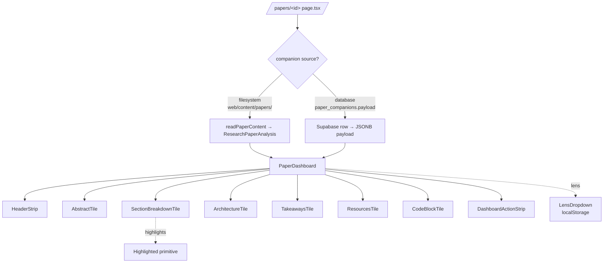

# Paper Pal — PR2b Implementation Plan (Dashboard salvage from PR #45)

> **For agentic workers:** REQUIRED SUB-SKILL: Use `superpowers:subagent-driven-development` (recommended) or `superpowers:executing-plans` to implement this plan task-by-task. Steps use checkbox (`- [ ]`) syntax for tracking.

**Status:** ready
**Date:** 2026-05-18
**Branch:** `claude/paper-pal-pr2b-dashboard-salvage`
**Source spec:** [`docs/superpowers/specs/2026-05-17-paper-pal-design.md`](../specs/2026-05-17-paper-pal-design.md) §"Dashboard tiles" + [`docs/superpowers/plans/2026-05-18-paper-pal-pr2-implementation.md`](./2026-05-18-paper-pal-pr2-implementation.md) (sibling PR2 plan, also #56).
**Salvage source:** PR #45 (`claude/implement-paper-pal-mvlis`, still OPEN). Code that won't merge cleanly but is worth lifting onto fresh main.
**Predecessor:** main as of 28981b7 (post #51, #52, #53, #54). **Does not depend on PR2 / #56 landing first** — these can ship in parallel.
**Budget:** ~7h.

---

## Goal

PR #45 contains a polished `PaperDashboard` + 8 content tiles + a lens switcher + a highlightable-prose primitive. None of it depends on the Edge Functions PR1 (#51) shipped — the tiles just render `paper_companions.payload` (which is `ResearchPaperAnalysis`). Lifting these onto fresh main gives `/papers/<id>` a real "synthesis dashboard" view today, without waiting for PR2's `/new` upload flow.

After PR2b:

1. `/papers/<id>` renders `<PaperDashboard>` with 8 themed bento tiles instead of the current `<PaperCompanion>` raw view (or alongside it, gated by a flag — see Slice 4).
2. The lens switcher (`beginner` / `engineer` / `expert`) is wired and persistent per paper via localStorage.
3. Highlightable prose works (term tooltips on hover).
4. PR #45 can be closed once this and PR2 both land.

## Non-goals (deferred or out of scope)

- **`/new` upload flow + Edge Function wiring** → PR2 / #56
- **`PresenterScreen` + `/papers/[id]/present/` route** → PR3 candidate
- **`InboxScreen` + `InboxCard`** → PR3 candidate
- **`TweaksPanel`** → needs a server-side persistence story; PR3
- **Assessment UI** (`McqMode`, `SocraticMode`) — PR2 owns these because they wire to Edge Functions; PR45's local-budget version is incompatible
- **Migration `015_paper_companions_role_widening.sql`** from PR45 — collides with main's `015_paper_pal_provider_metadata.sql`. Its logic is subsumed by 015+016 already in main; do **not** lift.
- **`/papers/[id]/present/layout.tsx` + `page.tsx`** routes — PR3
- **KaTeX math rendering** — deferred everywhere; tiles render LaTeX as `<code>` until then

## Architecture



`★ Insight ─────────────────────────────────────`
The key decision is the **dual source** at the top of the page. Main today reads filesystem fixtures (the 18 historical papers); PR1's Edge Functions write to DB. PR2b's page renders whichever source is present — filesystem wins if both exist (it's the curated version), DB fills in for newly-synthesized papers. This avoids forcing a data migration before the dashboard can ship.
`─────────────────────────────────────────────────`

---

## File structure

### New files (lifted from PR #45, dropped onto fresh main)

Lifted **as-is** unless noted:

- `web/lib/paperpal/types.ts` — `ResearchPaperAnalysis` + all sub-types (`TerminologyItem`, `MathExplanation`, `DiagramBreakdown`, `LearningResource`, `QuizQuestion`, `AssessmentQuiz`, `CodeSample`, `SocraticPrompt`, `Lens`, `SectionRef`)
- `web/lib/paperpal/hooks.ts` — `usePaperLocalState`, `recordHint` (kept for `LensDropdown`; `recordHint` lives unused until PR3 reuses it for budget UX)
- `web/components/paperpal/paperpal.css` — brand tokens, bento layout, shared utilities
- `web/components/paperpal/primitives.tsx` — `<Tile>`, `<TileHeader>`, button styles, badge primitives
- `web/components/paperpal/Highlighted.tsx` — highlightable prose with hover tooltips for terminology
- `web/components/paperpal/LensDropdown.tsx` — beginner/engineer/expert switcher, persists via `usePaperLocalState`
- `web/components/paperpal/dashboard/PaperDashboard.tsx` — top-level composition
- `web/components/paperpal/dashboard/HeaderStrip.tsx` — title, authors, venue, next-meeting hero
- `web/components/paperpal/dashboard/AbstractTile.tsx`
- `web/components/paperpal/dashboard/SectionBreakdownTile.tsx`
- `web/components/paperpal/dashboard/ArchitectureTile.tsx`
- `web/components/paperpal/dashboard/TakeawaysTile.tsx`
- `web/components/paperpal/dashboard/ResourcesTile.tsx`
- `web/components/paperpal/dashboard/CodeBlockTile.tsx`
- `web/components/paperpal/dashboard/DashboardActionStrip.tsx`

### New files (PR2b-original)

- `web/lib/paperpal/payloadAdapter.ts` — bridges filesystem `readPaperContent` output **or** `paper_companions.payload` row into the `ResearchPaperAnalysis` shape `PaperDashboard` expects. Single source of truth for which-source-wins logic.
- Test fixtures:
  - `web/__fixtures__/paperpal/full-payload.json` — exemplar `ResearchPaperAnalysis` (lift one from `web/content/papers/` if it conforms, otherwise hand-craft minimal)
  - `web/__fixtures__/paperpal/minimal-payload.json` — only required fields; verifies optional-field defaults
  - `web/__fixtures__/paperpal/legacy-payload.json` — old `web/content/papers/` shape if it differs from `ResearchPaperAnalysis`

### Tests

- `web/lib/paperpal/types.test.ts` — Zod-or-equivalent runtime validation against fixtures
- `web/lib/paperpal/payloadAdapter.test.ts` — covers: DB-only, filesystem-only, both-present (filesystem wins), neither-present, malformed payload
- `web/lib/paperpal/hooks.test.ts` — `usePaperLocalState` round-trip, lens default, multi-paper isolation
- Per-tile snapshot/render tests under `web/components/paperpal/dashboard/__tests__/`:
  - `AbstractTile.test.tsx`
  - `SectionBreakdownTile.test.tsx`
  - `ArchitectureTile.test.tsx`
  - `TakeawaysTile.test.tsx`
  - `ResourcesTile.test.tsx`
  - `CodeBlockTile.test.tsx`
  - `HeaderStrip.test.tsx`
  - `DashboardActionStrip.test.tsx`
- `web/components/paperpal/LensDropdown.test.tsx`
- `web/components/paperpal/Highlighted.test.tsx`
- `web/components/paperpal/dashboard/PaperDashboard.test.tsx` — full-payload integration render; lens switching triggers re-render

### Modified files

- `web/app/papers/[id]/page.tsx` — branch on payload-adapter result. If dashboard-ready → render `<PaperDashboard>`. If not (or behind flag) → keep current `<PaperCompanion>` fallback.
- `web/components/PaperCompanion.tsx` — **unchanged**; lives as fallback during the flag flip period.
- `web/app/layout.tsx` — **possibly** add font imports if PR45's `paperpal.css` references custom fonts the rest of the app doesn't load. Verify in Slice 2.
- `README.md` — add a "Dashboard view" line under the Paper Pal section.
- `web/.env.example` — add `NEXT_PUBLIC_PAPER_PAL_DASHBOARD` flag (defaults `false` until the rollout step in Slice 6).

### Convention notes

- Web tests use Vitest + Testing Library (matches existing `web/lib/*.test.ts` and the PR2 plan).
- Fixture files use `.json` (not `.ts`) so they're directly loadable and won't drift with TS refactors.
- Snapshot tests are scoped per-tile; do **not** snapshot the entire `PaperDashboard` (too brittle).
- Server components stay server components when lifted; only the explicitly `'use client'` files in PR #45 (`LensDropdown`, `Highlighted`, the interactive tiles) carry that directive forward.

---

## Resolved questions (decide while writing this plan)

| # | Question | Resolution | Rationale |
|---|---|---|---|
| Q1 | Filesystem or DB as the dashboard data source? | **Both** via `payloadAdapter`; filesystem wins if both exist | Filesystem fixtures (18 historical papers) are curated; DB rows are fresh AI output. Keep filesystem as the canonical-when-present path so curation isn't lost. |
| Q2 | Ship behind a flag? | **Yes** — `NEXT_PUBLIC_PAPER_PAL_DASHBOARD=false` default; flip per-env post-merge | Lets the team smoke-test on staging without removing the existing `<PaperCompanion>` view from prod. Mirrors PR2's `PAPER_PAL_INPORTAL_SYNTHESIS` pattern. |
| Q3 | What about KaTeX math rendering? | **Deferred** — render LaTeX as `<code>` for now | Spec defers KaTeX. Don't introduce katex.js in PR2b. |
| Q4 | Lift `recordHint` from `hooks.ts` even though PR2b doesn't use it? | **Yes** — keep `hooks.ts` as the file PR45 had it | Removing it forces a divergence the future hint-budget PR would have to undo. Cost of carrying: ~30 LOC of unused export. |
| Q5 | Lift the assessment dir (`McqMode`, `SocraticMode`, `AssessmentPanel`)? | **No** — PR2 owns these | PR45's design is local-state hint budget; PR2 wires live Edge Functions. Incompatible models. |
| Q6 | Cherry-pick via `git cherry-pick` or hand-port? | **Hand-port** (copy files, then `git add`) | PR45's commits span 6,630 lines mixed with files we don't want. Cherry-picking a subtree is more painful than just copying the files. Authorship gets attributed via commit message. |

---

## Slice-by-slice plan

### Slice 1 — Types + payload adapter (1.5h)

Lift `web/lib/paperpal/types.ts` from PR #45 as-is. Write `payloadAdapter.ts` from scratch — this is PR2b's only original logic.

**File:** `web/lib/paperpal/payloadAdapter.ts`

```ts
import type { ResearchPaperAnalysis } from "./types";
import { readPaperContent } from "@/lib/paperContent";
import type { SupabaseClient } from "@supabase/supabase-js";

export type DashboardSource = "filesystem" | "database" | "none";

export type AdapterResult =
  | { source: "filesystem" | "database"; payload: ResearchPaperAnalysis }
  | { source: "none"; payload: null };

export async function loadDashboardPayload(
  sb: SupabaseClient,
  paperId: number,
  legacyId: string,
): Promise<AdapterResult> {
  // 1. Filesystem fixture wins if it exists (curated > AI-generated).
  const fs = await readPaperContent(legacyId).catch(() => null);
  if (fs) return { source: "filesystem", payload: fs as ResearchPaperAnalysis };

  // 2. DB row (paper_companions.payload).
  const { data } = await sb
    .from("paper_companions")
    .select("payload")
    .eq("paper_id", paperId)
    .maybeSingle();
  if (data?.payload) {
    return { source: "database", payload: data.payload as ResearchPaperAnalysis };
  }

  return { source: "none", payload: null };
}
```

#### Tasks

- [ ] **RED** — `web/lib/paperpal/payloadAdapter.test.ts`:
  - FS present, DB absent → returns `{source: "filesystem", payload}`
  - FS absent, DB present → returns `{source: "database", payload}`
  - **FS present + DB present → filesystem wins** (curation priority)
  - Both absent → returns `{source: "none", payload: null}`
  - DB malformed (non-object) → returns `{source: "none"}` (log but don't throw)
  - FS read errors → fall through to DB (defensive)
- [ ] **RED** — `web/lib/paperpal/types.test.ts`:
  - `full-payload.json` fixture loads into `ResearchPaperAnalysis` shape
  - `minimal-payload.json` fixture loads, optional fields are `undefined`
  - Sanity: `legacy-payload.json` from an existing `web/content/papers/` file passes (or surface the mismatch as a test failure that drives Slice 1's bridge logic)
- [ ] **GREEN** — lift `types.ts` from PR45; implement `payloadAdapter.ts`.
- [ ] Commit RED + GREEN.

`★ Insight ─────────────────────────────────────`
The "filesystem wins" rule is reversible later — if curation moves into the DB, flip the order and delete `readPaperContent`. Encoding the priority in `payloadAdapter` (one place) instead of in `page.tsx` is what makes that future change a one-line edit.
`─────────────────────────────────────────────────`

### Slice 2 — Primitives + hooks + Highlighted + Lens (1.5h)

Lift the foundation layer that everything else depends on.

#### Tasks

- [ ] **RED** — `web/lib/paperpal/hooks.test.ts`:
  - `usePaperLocalState` round-trip: write a value, re-render, read it back
  - Multi-paper isolation: paper 42's lens doesn't bleed into paper 43's
  - `recordHint` is exported and callable (no behavior assertion — just guard against accidental removal)
- [ ] **RED** — `web/components/paperpal/LensDropdown.test.tsx`:
  - Defaults to `engineer`
  - Click → opens menu → select `beginner` → persists; re-render reads `beginner`
  - Renders all three lens labels
- [ ] **RED** — `web/components/paperpal/Highlighted.test.tsx`:
  - Wraps `term` substrings in highlightable spans
  - Hover surfaces tooltip with `definition`
  - Terms not present in the prose are silently ignored (no throw)
- [ ] **GREEN** — lift `hooks.ts`, `primitives.tsx`, `paperpal.css`, `Highlighted.tsx`, `LensDropdown.tsx`. Verify fonts in `paperpal.css` either match `web/app/layout.tsx`'s `<link>` tags or get added there.
- [ ] Commit RED + GREEN.

### Slice 3 — Dashboard tiles (2h)

Lift the 8 tiles + `PaperDashboard`. Each tile gets a render test against the full-payload fixture; the `PaperDashboard` itself gets one integration test.

#### Tasks

- [ ] **RED** — 8 per-tile test files. Each asserts:
  - Renders without throwing on the full-payload fixture
  - Renders the headline copy (title, section name, etc.) from the payload
  - Handles `undefined` for the optional fields it consumes (graceful degradation)
- [ ] **RED** — `PaperDashboard.test.tsx`:
  - Renders all 8 child tiles when given full payload
  - Lens switch via `LensDropdown` re-renders prose (snapshot before + after lens change)
  - Empty `nextMeeting` prop renders without the meeting hero
- [ ] **GREEN** — lift `dashboard/*.tsx` (8 tiles + PaperDashboard). Run tests.
- [ ] Verify no `'use client'` regressions: server components stay server, client tiles keep their directive.
- [ ] Commit RED + GREEN.

### Slice 4 — Wire `/papers/[id]/page.tsx` (1.25h)

The user-visible change. Branch on the adapter result + flag.

```ts
// web/app/papers/[id]/page.tsx — modified excerpt
import { loadDashboardPayload } from "@/lib/paperpal/payloadAdapter";
import { PaperDashboard } from "@/components/paperpal/dashboard/PaperDashboard";

const DASHBOARD_ON = process.env.NEXT_PUBLIC_PAPER_PAL_DASHBOARD === "true";

// ... existing setup ...
const adapter = await loadDashboardPayload(sb, paperIdNum, params.id);

if (DASHBOARD_ON && adapter.source !== "none") {
  return (
    <PaperDashboard
      paperId={params.id}
      payload={adapter.payload}
      paper={catalog ? { title: catalog.title, /* ... */ } : undefined}
      nextMeeting={/* TODO: PR3 hooks this up */ null}
    />
  );
}

// Existing PaperCompanion fallback path stays unchanged.
```

#### Tasks

- [ ] **RED** — extend `web/app/papers/[id]/page.test.tsx` (or create if absent):
  - Flag off + adapter has payload → renders `<PaperCompanion>` (current behavior preserved)
  - Flag on + adapter `none` → renders `<PaperCompanion>` (fallback safe)
  - Flag on + adapter has payload → renders `<PaperDashboard>`
  - Synthesize-prompt path (catalog without companion) still triggers for owner/leader
- [ ] **GREEN** — wire the branch.
- [ ] Commit RED + GREEN.

### Slice 5 — Optional: lift orthogonal goodies (0.5h)

Two small bonuses if Slice 4 left time:

- [ ] If `web/content/papers/<id>.json` files don't match `ResearchPaperAnalysis` exactly, write a one-shot translation layer **inside `payloadAdapter`** (not a migration). Document in `payloadAdapter.ts` comments.
- [ ] Add a `?lens=beginner` URL param honored by `<LensDropdown>` on first paint — enables sharable lens-specific links without code changes elsewhere.

### Slice 6 — Docs + flag flip (0.25h)

- [ ] `README.md`: under Paper Pal, add a line "Rich dashboard view at `/papers/<id>` when `NEXT_PUBLIC_PAPER_PAL_DASHBOARD=true`."
- [ ] `web/.env.example`: document `NEXT_PUBLIC_PAPER_PAL_DASHBOARD`.
- [ ] Smoke test on staging: pick 3 papers — one filesystem-only, one DB-only (after PR2 ships), one with both — verify each renders correctly.
- [ ] After smoke passes: `vercel env add NEXT_PUBLIC_PAPER_PAL_DASHBOARD=true` for production.
- [ ] Update PR #45 with a closing comment pointing at PR2 + PR2b + the PR3 deferral list.

---

## TDD commit order (per global CLAUDE.md)

| # | Phase | Slice | Scope |
|---|---|---|---|
| 1 | RED | 1 | `payloadAdapter.test.ts` + `types.test.ts` |
| 2 | GREEN | 1 | Lift `types.ts`; implement `payloadAdapter.ts` |
| 3 | RED | 2 | `hooks.test.ts` + `LensDropdown.test.tsx` + `Highlighted.test.tsx` |
| 4 | GREEN | 2 | Lift `hooks.ts`, `primitives.tsx`, `paperpal.css`, `Highlighted.tsx`, `LensDropdown.tsx` |
| 5 | RED | 3 | 8 tile tests + `PaperDashboard.test.tsx` |
| 6 | GREEN | 3 | Lift dashboard dir |
| 7 | RED | 4 | `page.test.tsx` — 4 flag/source branches |
| 8 | GREEN | 4 | Wire `/papers/[id]/page.tsx` |
| 9 | DOCS | 5+6 | README + env example + smoke notes |

After each GREEN: `eslint`, `tsc --noEmit`, and full Vitest run pass before committing.

---

## Pre-PR self-review checklist (per global CLAUDE.md)

- [ ] Verified `web/content/papers/<id>.json` shape matches (or `payloadAdapter` translates) `ResearchPaperAnalysis`
- [ ] No mention of `015_paper_companions_role_widening.sql` anywhere — that migration is **not** part of PR2b
- [ ] No `McqMode`/`SocraticMode`/`AssessmentPanel` files lifted (PR2 owns these)
- [ ] No `PresenterScreen`/`InboxScreen`/`TweaksPanel` (PR3)
- [ ] `NEXT_PUBLIC_PAPER_PAL_DASHBOARD=false` default preserved — flip is ops-only
- [ ] PR #45's commit authors credited in the salvage commits (`Co-Authored-By` lines)
- [ ] Fonts referenced by `paperpal.css` are loaded in `web/app/layout.tsx`
- [ ] No `katex` import sneaks in via tiles (math renders as `<code>` until KaTeX PR)
- [ ] PR description links the spec, the PR2 plan (#56), and PR #45

## Parallelization with PR2

PR2b and PR2 (#56's code PR) are **fully independent**:

- PR2 modifies: Edge Function consumers, `/new` page, migrations 017, hint/socratic wiring
- PR2b modifies: `/papers/[id]/page.tsx` rendering branch, `web/components/paperpal/*` (new files), types

The only shared file is `web/app/papers/[id]/page.tsx`. PR2 doesn't currently plan to modify it. If a conflict emerges, it's small and resolvable in whichever PR lands second.

**Recommended landing order:** PR2 first (unblocks browser synthesis end-to-end), then PR2b (puts a pretty dashboard on what PR2 just synthesized). But either order works; both can be merged the same day.

## Risk register

| Risk | Likelihood | Mitigation |
|---|---|---|
| `web/content/papers/<id>.json` shape doesn't match `ResearchPaperAnalysis` exactly | medium | Slice 1 includes a `legacy-payload.json` test fixture; if mismatched, `payloadAdapter` gets a translation layer (Slice 5 bullet) |
| Fonts in `paperpal.css` aren't loaded → silent fallback to system font | low | Slice 2 task explicitly verifies; add `<link>` to `layout.tsx` if missing |
| Server/client component split breaks during lift | medium | Per-tile render tests catch it; if a tile errors with "useState on the server" it's a missing `'use client'` directive |
| Dashboard renders raw `mermaidCode` strings without Mermaid loaded | medium | Spec defers Mermaid rendering; tile shows code as `<code>` block until a future PR adds rendering. Document in tile comment. |
| `paper_companions.payload` shape from PR1's Edge Functions diverges from PR45's `ResearchPaperAnalysis` | low | Sample one row from staging post-PR1 deploy; if shape differs, treat it as a contract bug in PR1 and fix forward there |
| Closing PR #45 loses commit attribution | low | Salvage commits include `Co-Authored-By` for PR45's authors; PR2b description links #45 explicitly |
