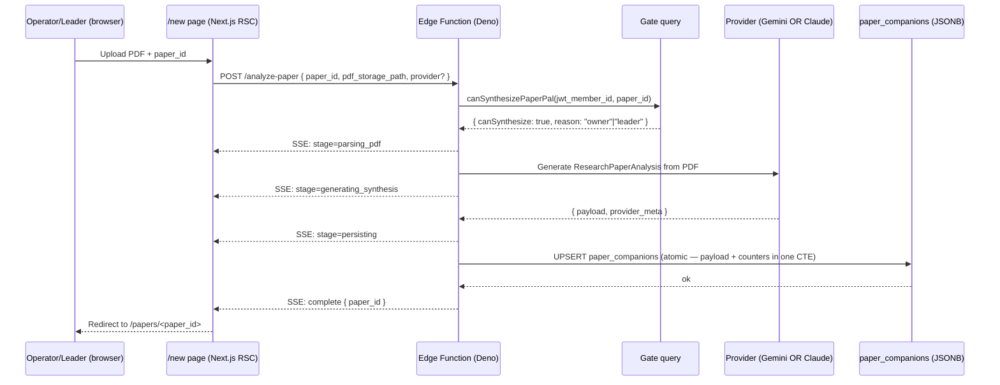

# Paper Pal — Edge Functions for In-Portal Synthesis

**Status:** draft
**Date:** 2026-05-17
**Author:** Claude (session_gallant-shockley-101061)
**Companion to:** [`2026-05-17-paper-pal-design.md`](./2026-05-17-paper-pal-design.md) (#47), PR #45 (rebased)
**Scope:** all three Edge Functions — `analyze-paper`, `analyze-hint`, `analyze-socratic`

---

## 1. Goal

Move Paper Pal synthesis from the out-of-band `/wids-make-companion` slash command into in-portal Supabase Edge Functions, so the operator (or paper's meeting leader) can:

1. Open `/new`, upload a PDF, and trigger synthesis from the browser
2. Get a Socratic hint or grade an assessment answer without a Claude session running

The Edge Functions write to `paper_companions.payload` (JSONB) which `/papers/<id>` already reads in the rebased #45.

## 2. Non-goals

- KaTeX math rendering (Phase deferred in #45)
- Discussion board / SR review (Phases 8 & 9, NEEDS SCHEMA)
- Removing `/wids-make-companion` — kept as fallback for the foreseeable future
- **True token streaming** — `analyze-paper` emits stage-progress SSE (see §11 Q4), but the underlying provider response is collected fully before persisting; we don't stream Gemini/Claude tokens through to the client

## 3. Architecture



`analyze-hint` and `analyze-socratic` follow the same gate-then-provider pattern but are **per-question**, not per-paper — they don't write to `paper_companions`.

## 4. The three Edge Functions

### 4.1 `analyze-paper`
- **Method:** `POST` (not `GET` — the body carries a Supabase Storage signed URL)
- **Body:** `{ paper_id: number, pdf_storage_path: string, provider?: "gemini" | "claude" }` where `pdf_storage_path` is a path inside the `papers-pdfs` bucket; the Edge Function mints its own signed URL server-side (see §8 + §13 security)
- **Gate:** caller must satisfy `canSynthesizePaperPal(paper_id)` against their JWT
- **Rate limit:** `429` with `Retry-After` header if `now() - last_synthesis_at < PAPER_PAL_REGEN_COOLDOWN_SEC` (see §11 Q2 + Q5)
- **Response format:** `text/event-stream` (SSE) over the `POST` connection. Because `EventSource` only supports `GET`, the `/new` client must consume via `fetch()` + `response.body.getReader()` + a small SSE chunk parser, **not** `new EventSource(url)`. See §13 for the client snippet.
- **Side effect (atomic, single transaction):** UPSERT into `paper_companions` keyed on `paper_id`, setting `payload`, `provider`, `model`, `generated_by_member_id`, `generated_at = now()`, `last_synthesis_at = now()`, and `regeneration_count = regeneration_count + 1` (CTE pattern so the increment can't be lost on crash mid-write)
- **Idempotency:** safe to retry once rate-limit window passes — upsert overwrites by `paper_id`

### 4.2 `analyze-hint`
- **Method:** `POST`
- **Body:** `{ paper_id: number, question_id: string, user_answer: string }`
- **Gate:** any signed-in member with an `attending` RSVP for a meeting using this paper (looser than synthesis gate — readers can ask for hints on their own attempts)
- **Side effect:** none — pure response
- **Returns:** `{ hint: string, confidence: "low"|"medium"|"high" }`

### 4.3 `analyze-socratic`
- **Method:** `POST`
- **Body:** `{ paper_id: number, prompt_id: string, user_response: string, turn_number: number }`
- **Gate:** same as `analyze-hint`
- **Side effect:** append to `paper_socratic_turns` table (new — see §6)
- **Returns:** `{ next_question: string, summary?: string }`

`★ Why split into three:` Synthesis is expensive (full PDF context, ~$0.10–$0.50/paper). Hints and Socratic turns are cheap per-call but bursty. Splitting lets us tune timeouts (synthesis ~60s, hint/socratic ~10s) and rate-limit independently.

## 5. Provider abstraction (Gemini + Claude behind a flag)

A single `synthesizePaper(input, opts)` helper in `lib/paperpal/providers/` dispatches on `opts.provider`:

```ts
// lib/paperpal/providers/index.ts
export type Provider = "gemini" | "claude";

export async function synthesizePaper(
  input: { pdf_url: string },
  opts: { provider: Provider; model?: string }
): Promise<{ payload: ResearchPaperAnalysis; meta: ProviderMeta }> {
  if (opts.provider === "gemini") return geminiSynthesize(input, opts);
  if (opts.provider === "claude") return claudeSynthesize(input, opts);
  throw new Error(`unknown provider ${opts.provider}`);
}
```

- **Gemini path:** uses the file upload API directly (native PDF, `inline_data` or `file_uri`). Already prototyped in the #45 `/new` page stub.
- **Claude path:** uses the Anthropic SDK with PDF as a `document` content block (base64-inline if <32MB, file-API reference otherwise). Prompt caching enabled on the system prompt (per `claude-api` skill).
- **Flag:** env var `PAPER_PAL_PROVIDER` (default `"gemini"`); request body's `provider` field overrides if the caller is `'admin'` (A/B testing only).

Same abstraction for `analyze-hint` and `analyze-socratic` — different prompts, same dispatch.

## 6. Schema changes

```sql
-- migration 015_paper_pal_provider_metadata.sql

-- Step 1: add provider column with 'manual' as the historical-truth default,
-- because pre-migration synthesis happened via /wids-make-companion (operator
-- session, not Gemini). Setting DEFAULT 'gemini' would silently misattribute
-- every backfilled row.
ALTER TABLE paper_companions
  ADD COLUMN provider text NOT NULL DEFAULT 'manual'
    CHECK (provider IN ('gemini', 'claude', 'manual'));

-- Step 2: change the default to 'gemini' for future inserts.
ALTER TABLE paper_companions ALTER COLUMN provider SET DEFAULT 'gemini';

ALTER TABLE paper_companions
  ADD COLUMN model text,                         -- e.g. 'gemini-2.5-pro', 'claude-sonnet-4-7'
  ADD COLUMN generated_by_member_id bigint REFERENCES members(id) ON DELETE SET NULL,
  ADD COLUMN generated_at timestamptz NOT NULL DEFAULT now(),
  ADD COLUMN last_synthesis_at timestamptz,        -- rate-limit cursor (see §11 Q2)
  ADD COLUMN regeneration_count integer NOT NULL DEFAULT 0;  -- telemetry only, NOT enforcement

-- For Socratic turn history. PRIMARY KEY style (bigserial vs IDENTITY) should
-- match whatever the existing migrations in this repo use — implementer:
-- check `migrations/013_paper_companions.sql` and copy that convention.
CREATE TABLE paper_socratic_turns (
  id bigserial PRIMARY KEY,
  paper_id bigint NOT NULL REFERENCES papers(id) ON DELETE CASCADE,
  member_id bigint NOT NULL REFERENCES members(id) ON DELETE CASCADE,
  prompt_id text NOT NULL,
  turn_number integer NOT NULL,
  user_response text NOT NULL,
  ai_next_question text,
  ai_summary text,
  provider text NOT NULL,
  model text,
  created_at timestamptz NOT NULL DEFAULT now()
);
CREATE INDEX paper_socratic_turns_paper_member ON paper_socratic_turns(paper_id, member_id);

ALTER TABLE paper_socratic_turns ENABLE ROW LEVEL SECURITY;

-- Members can read their own turn history (for "resume Socratic session" UX).
CREATE POLICY "members read own turns" ON paper_socratic_turns
  FOR SELECT USING (member_id = current_member_id());

-- Direct member-context inserts are blocked. The analyze-socratic Edge Function
-- writes via the service role key, which bypasses RLS — this policy exists to
-- forbid accidental inserts from anywhere else (e.g. an RPC, the Supabase
-- dashboard, a future API route that forgets to use the service role).
CREATE POLICY "block direct member inserts" ON paper_socratic_turns
  FOR INSERT WITH CHECK (false);
```

## 7. Auth gate — re-using `canSynthesizePaperPal` from Deno

`canSynthesizePaperPal` lives in `web/lib/queries.ts` (Node). Edge Functions run on Deno and can't import that file directly.

Two options:
1. **Port the helper to a shared SQL function** (`can_synthesize_paper_pal(paper_id bigint) returns synthesis_gate`) callable from both Node and Deno via `sb.rpc()`. **Recommended** — single source of truth.
2. **Duplicate the logic in Deno.** Fast to write, drifts immediately.

Going with (1). New migration:

```sql
-- migration 016_synthesis_gate_rpc.sql
CREATE OR REPLACE FUNCTION can_synthesize_paper_pal(p_paper_id bigint)
RETURNS jsonb LANGUAGE plpgsql SECURITY DEFINER AS $$
DECLARE
  v_member_id bigint;
  v_role text;
  v_is_leader boolean;
BEGIN
  v_member_id := current_member_id();
  IF v_member_id IS NULL THEN
    RETURN jsonb_build_object('canSynthesize', false, 'reason', 'none');
  END IF;
  SELECT role INTO v_role FROM members WHERE id = v_member_id;
  IF v_role IN ('operator', 'admin') THEN
    RETURN jsonb_build_object('canSynthesize', true, 'reason', 'owner');
  END IF;
  SELECT EXISTS(
    SELECT 1 FROM meetings WHERE paper_id = p_paper_id AND leader_id = v_member_id
  ) INTO v_is_leader;
  IF v_is_leader THEN
    RETURN jsonb_build_object('canSynthesize', true, 'reason', 'leader');
  END IF;
  RETURN jsonb_build_object('canSynthesize', false, 'reason', 'none');
END;
$$;
```

Then `web/lib/queries.ts`'s `canSynthesizePaperPal` becomes a thin wrapper around `sb.rpc('can_synthesize_paper_pal', ...)`. Edge Function does the same.

## 8. `/new` page wiring (replaces the #45 stub)

Replace the Gemini-upload-flow stub with:

1. PDF picker → upload to Supabase Storage bucket `papers-pdfs` at path `<paper_id>/<uuid>.pdf`. RLS on the bucket:
   - **Insert:** allowed for members where `canSynthesizePaperPal(paper_id) = true` (owner or paper's leader)
   - **Select:** allowed only via service-role signed URLs minted by the Edge Function (no public read, no anon-token read)
2. `POST /functions/v1/analyze-paper` with `{ paper_id, pdf_storage_path }` — the path, not a URL. The Edge Function mints its own signed URL server-side, eliminating SSRF risk from caller-supplied URLs.
3. Subscribe to the SSE response via `fetch()` + `ReadableStream` (see §13 for the client snippet — `EventSource` does **not** work for `POST`).
4. On `complete` event → `router.push('/papers/' + paper_id)`
5. On error event or HTTP non-2xx → toast + retain form state

Assessment UI (already in #45's `McqMode` and `SocraticMode`) wires `/analyze-hint` and `/analyze-socratic` via plain `fetch()` (no streaming — those endpoints return JSON).

## 9. Test plan

Unit (Vitest, on the Node side):
- [ ] `synthesizePaper` dispatches correctly for each provider
- [ ] Provider response is validated against `ResearchPaperAnalysis` schema (zod)
- [ ] `canSynthesizePaperPal` Node wrapper returns the RPC result verbatim

Integration (Deno, in Supabase):
- [ ] `analyze-paper` rejects unauthenticated caller (401)
- [ ] `analyze-paper` rejects authenticated non-leader/non-operator (403)
- [ ] `analyze-paper` writes `payload`, `provider`, `model`, `generated_by_member_id`
- [ ] Re-running increments `regeneration_count`
- [ ] `analyze-hint` returns a non-empty hint for a valid `question_id`
- [ ] `analyze-socratic` appends to `paper_socratic_turns`

E2E (Playwright, against staging Supabase branch):
- [ ] Operator: upload PDF → see Paper Pal render on `/papers/<id>` within 90s
- [ ] Leader (non-operator) for a paper they lead: same flow succeeds
- [ ] Member (non-leader): `/new` page denies, `/papers/<id>` empty-state shown

## 10. Rollout

1. **PR 1 (this slice):** migrations 015 + 016, Edge Function code, provider abstraction, `synthesizePaper`, `wids-prune-paper-pdfs` scheduled task (dry-run on), tests
2. **PR 2:** wire `/new` page (replace stub), wire assessment UI to hint/socratic functions, flip `wids-prune-paper-pdfs` from dry-run to live after first successful run
3. **PR 3 (post-launch):** deprecate `/wids-make-companion` after operator validates 3 papers end-to-end in-portal

Feature flag: `PAPER_PAL_INPORTAL_SYNTHESIS` (env var, defaults false). When false, `/new` shows "in-portal synthesis is in beta — use /wids-make-companion".

## 11. Resolved questions

> Originally drafted as open questions; resolved 2026-05-17.

### Q1 — PDF storage retention → **Keep indefinitely, soft-prune at 500 MB**

Papers are public arXiv preprints (no PII risk). At ~5 MB × ~25 papers/year, fills <150 MB/year — well inside the Supabase 1 GB free tier. Deletion creates a future cost: if the synthesis prompt changes 6 months from now, regenerating against the original PDF beats re-downloading one that may have moved or vanished.

**Policy:** keep PDFs in `papers-pdfs` indefinitely. If bucket size > 500 MB, prune oldest by `created_at`. No code action needed for PR1.

### Q2 — Cost ceiling → **Rate-limit (1 regen / paper / 5 min), no count cap**

A hard count cap punishes legitimate prompt-tuning (3–5 iterations are normal on the first synthesis). The real failure mode is a tight loop, which rate-limiting catches without limiting deliberate regeneration.

**Implementation in `analyze-paper`:**

```ts
const { data: existing } = await sb
  .from("paper_companions")
  .select("last_synthesis_at")
  .eq("paper_id", paper_id)
  .maybeSingle();

if (existing?.last_synthesis_at) {
  const elapsedMs = Date.now() - new Date(existing.last_synthesis_at).getTime();
  if (elapsedMs < 5 * 60 * 1000) {
    return new Response(JSON.stringify({
      error: "rate_limited",
      retry_after_seconds: Math.ceil((5 * 60 * 1000 - elapsedMs) / 1000),
    }), { status: 429, headers: { "Retry-After": String(Math.ceil((5 * 60 * 1000 - elapsedMs) / 1000)) }});
  }
}
```

`regeneration_count` stays in migration 015 as **telemetry only** (incremented on every successful synthesis). Useful for spotting papers being thrashed; not used to block.

### Q3 — A/B logging → **Use `paper_companions` provider/model columns; no audit table**

The real A/B comparison is two browser tabs side-by-side, not a log query. The logging requirement collapses to *provenance*: who, what provider/model, when. Migration 015 already captures all of it (`provider`, `model`, `generated_by_member_id`, `generated_at`, `regeneration_count`).

If real telemetry needs arise later (token counts, p99 latency, cost-per-provider), add a `paper_companion_runs` audit table in a future PR. For now: Supabase Function logs cover "did it succeed" for free.

### Q4 — Streaming → **Stage-based SSE in PR2; defer true token streaming**

Token streaming requires NDJSON output or post-hoc JSON reconstruction — both fragile, both stateful in the Edge Function. The user pain is "60-second spinner with no feedback," which a 5-stage Server-Sent Events stream solves at ~10% of the complexity and ~80% of the perceived-latency win.

**Stage events emitted by `analyze-paper`:**

| event | when | data |
|---|---|---|
| `stage` | PDF parsed | `{ "stage": "parsing_pdf", "elapsed_ms": ~1000 }` |
| `stage` | Provider call starts | `{ "stage": "generating_synthesis", "elapsed_ms": ~2000 }` |
| `stage` | Synthesis bento ready | `{ "stage": "drafting_assessment", "elapsed_ms": ~30000 }` |
| `stage` | Writing to DB | `{ "stage": "persisting", "elapsed_ms": ~55000 }` |
| `complete` | Done | `{ "paper_id": 42, "provider": "gemini", "duration_ms": ~58000 }` |

`/new` page subscribes via `EventSource` and renders a 5-step progress bar. True token streaming added only if a user explicitly asks to see it write.

## 11.5 Resolved follow-up questions

> Raised by the §11 resolutions; resolved 2026-05-17.

### Q5 — Rate-limit window → **Tunable via `PAPER_PAL_REGEN_COOLDOWN_SEC` env var**

Hard-coding 5 minutes punishes PR1 development (each prompt-tuning iteration burns the 5-minute window). Parameterize:

- **Prod default:** `300` (5 min)
- **Non-prod / preview:** `30`
- **Read at:** the top of `analyze-paper` handler, with `parseInt(Deno.env.get("PAPER_PAL_REGEN_COOLDOWN_SEC") ?? "300", 10)`

The §11 Q2 implementation snippet becomes:

```ts
const cooldownMs = (parseInt(Deno.env.get("PAPER_PAL_REGEN_COOLDOWN_SEC") ?? "300", 10)) * 1000;
// …
if (existing?.last_synthesis_at) {
  const elapsedMs = Date.now() - new Date(existing.last_synthesis_at).getTime();
  if (elapsedMs < cooldownMs) {
    const retryAfter = Math.ceil((cooldownMs - elapsedMs) / 1000);
    return new Response(
      JSON.stringify({ error: "rate_limited", retry_after_seconds: retryAfter }),
      { status: 429, headers: { "Retry-After": String(retryAfter) } },
    );
  }
}
```

Document the env var in `supabase/functions/.env.example` as part of PR1.

### Q6 — Bucket pruning automation → **Ship `wids-prune-paper-pdfs` scheduled task in PR1**

The 500 MB soft-prune is policy-only until a scheduled task enforces it. Waiting until 400 MB means a future manual scramble. Ship it now while the architecture is fresh.

**Specification:**
- **Schedule:** weekly, e.g. Sunday 02:00 UTC
- **Action:** list objects in `papers-pdfs` bucket, sum sizes; if total > 500 MB, delete oldest-first by `created_at` until total < 450 MB
- **Idempotency:** safe — pure-read-then-delete; no state past the bucket itself
- **Logging:** `INSERT INTO command_log (command, payload, status)` with deleted-paths array, matching the existing scheduled-task pattern (see `wids-pre-meeting-reminder` for the canonical template)
- **Safety rail:** dry-run flag (`PAPER_PAL_PRUNE_DRY_RUN=true`) that logs what would be deleted without actually deleting — default true in PR1, flip to false after first successful dry run

Adds to `mcp__scheduled-tasks__create_scheduled_task` setup as a one-time bootstrap step in PR1's deploy checklist.

## 12. Estimated effort

| Step | PR | Effort |
|---|---|---|
| Migrations 015 + 016 + RPC | 1 | 2h |
| Provider abstraction (Gemini + Claude) | 1 | 4h |
| `analyze-paper` Edge Function + rate-limit (env-tunable) + SSE + tests | 1 | 5h |
| `analyze-hint` Edge Function + tests | 1 | 2h |
| `analyze-socratic` Edge Function + turns table + tests | 1 | 4h |
| `wids-prune-paper-pdfs` scheduled task + dry-run + bootstrap | 1 | 2h |
| `/new` page wiring + Storage bucket setup + SSE consumer | 2 | 4h |
| Assessment UI wiring (`McqMode`/`SocraticMode` → fetch) | 2 | 3h |
| Docs + deploy + smoke (across both PRs) | 1+2 | 2h |
| **PR 1 subtotal** | | **~19h** |
| **PR 2 subtotal** | | **~7h** |
| **Combined total** | | **~28h** |

> +4h vs the initial estimate: +2h for SSE emit/consume + rate-limit logic (§11 Q4 + Q2), +2h for the `wids-prune-paper-pdfs` scheduled task (§11.5 Q6).

## 13. Implementation contracts

This section pins down the wire-level details that ambiguity in earlier sections leaves open. Resolving these here is what lets PR1 land without API redesigns.

### 13.1 Edge Function SSE response headers

```ts
return new Response(stream, {
  headers: {
    "Content-Type": "text/event-stream",
    "Cache-Control": "no-cache, no-transform",
    "Connection": "keep-alive",
    "X-Accel-Buffering": "no",          // disables proxy buffering on hosted Supabase
  },
});
```

`X-Accel-Buffering: no` is required because Supabase Edge Functions sit behind a proxy that otherwise buffers responses to 8 KB chunks — fine for JSON, fatal for SSE.

### 13.2 `/new` client: consuming SSE from a `POST`

`EventSource` is `GET`-only. Use `fetch()` + a chunked-text parser:

```ts
const res = await fetch("/functions/v1/analyze-paper", {
  method: "POST",
  headers: {
    "Content-Type": "application/json",
    "Authorization": `Bearer ${session.access_token}`,
  },
  body: JSON.stringify({ paper_id, pdf_storage_path }),
});

if (!res.ok) {
  // Handle 429, 401, 403 before attempting to stream.
  const err = await res.json();
  if (res.status === 429) toast(`Rate-limited, retry in ${err.retry_after_seconds}s`);
  return;
}

const reader = res.body!.pipeThrough(new TextDecoderStream()).getReader();
let buf = "";
while (true) {
  const { done, value } = await reader.read();
  if (done) break;
  buf += value;
  // SSE frames are separated by a blank line.
  const frames = buf.split("\n\n");
  buf = frames.pop()!;
  for (const frame of frames) {
    const event = parseSseFrame(frame);  // { event, data }
    if (event.event === "stage") setProgress(event.data);
    if (event.event === "complete") router.push(`/papers/${event.data.paper_id}`);
    if (event.event === "error") toast(event.data.message);
  }
}
```

Tested pattern: identical to how the AI SDK and OpenAI's JavaScript client consume their streaming endpoints.

### 13.3 Edge Function timeout

Supabase Edge Functions default to **150 seconds** wall-clock (as of late 2025; verify current limit before implementation). Set explicitly via `supabase functions deploy analyze-paper --execution-timeout 120` and document in the deploy checklist. `analyze-paper` should reject any provider call that hasn't returned within `EDGE_TIMEOUT_MS - 10000` to leave 10 seconds for the persistence step + SSE close.

### 13.4 PDF source: storage path, not arbitrary URL

The Edge Function body accepts `pdf_storage_path` (a path inside `papers-pdfs`), **not** an arbitrary URL. The function mints its own signed URL via `supabase.storage.from("papers-pdfs").createSignedUrl(path, 60)` and passes that to the provider. Rationale:

- Eliminates SSRF: caller can't trick the function into fetching internal endpoints.
- No URL-leak risk: signed URLs are short-lived (60s) and never leave the Edge Function process.
- Path validation: function asserts the path starts with `${paper_id}/` to prevent cross-paper access.

### 13.5 `provider` override authority

The request body's optional `provider` field is honored **only if the caller's JWT-derived role is `'admin'`**. The Edge Function calls `can_synthesize_paper_pal()` for the auth gate (which returns reason `'owner'`/`'leader'`) plus a separate role lookup:

```ts
const { data: callerRole } = await sb.from("members")
  .select("role").eq("id", currentMemberId).maybeSingle();
const effectiveProvider = (
  callerRole?.role === "admin" && body.provider
    ? body.provider
    : (Deno.env.get("PAPER_PAL_PROVIDER") ?? "gemini")
);
```

Non-admin requests with `provider` in the body get the env-default silently (no error, no warning) — A/B is admin-only by design.

### 13.6 `analyze-paper` UPSERT — atomicity

The side effect must be a single statement (so a crash mid-write can't leave `regeneration_count` desynced from `payload`):

```sql
INSERT INTO paper_companions
  (paper_id, payload, provider, model, generated_by_member_id,
   generated_at, last_synthesis_at, regeneration_count)
VALUES
  ($1, $2, $3, $4, $5, now(), now(), 1)
ON CONFLICT (paper_id) DO UPDATE SET
  payload = EXCLUDED.payload,
  provider = EXCLUDED.provider,
  model = EXCLUDED.model,
  generated_by_member_id = EXCLUDED.generated_by_member_id,
  generated_at = now(),
  last_synthesis_at = now(),
  regeneration_count = paper_companions.regeneration_count + 1;
```

Single statement, single transaction, atomic by Postgres semantics. No CTE needed.
