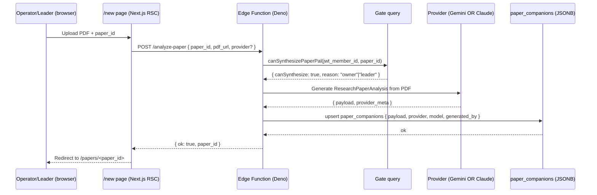

# Paper Pal — Edge Functions for In-Portal Synthesis

**Status:** draft
**Date:** 2026-05-17
**Author:** Claude (session_gallant-shockley-101061)
**Companion to:** [`2026-05-17-paper-pal-design.md`](./2026-05-17-paper-pal-design.md) (#47), PR #45 (rebased)
**Scope:** all three Edge Functions — `analyze-paper`, `analyze-hint`, `analyze-socratic`

---

## 1. Goal

Move Paper Pal synthesis from the out-of-band `/wids-make-companion` slash command into in-portal Supabase Edge Functions, so the operator (or paper's meeting leader) can:

1. Open `/new`, upload a PDF, and trigger synthesis from the browser
2. Get a Socratic hint or grade an assessment answer without a Claude session running

The Edge Functions write to `paper_companions.payload` (JSONB) which `/papers/<id>` already reads in the rebased #45.

## 2. Non-goals

- KaTeX math rendering (Phase deferred in #45)
- Discussion board / SR review (Phases 8 & 9, NEEDS SCHEMA)
- Removing `/wids-make-companion` — kept as fallback for the foreseeable future
- Streaming responses — first cut is request/response, even though Gemini and Claude both support streaming

## 3. Architecture



`analyze-hint` and `analyze-socratic` follow the same gate-then-provider pattern but are **per-question**, not per-paper — they don't write to `paper_companions`.

## 4. The three Edge Functions

### 4.1 `analyze-paper`
- **Method:** `POST`
- **Body:** `{ paper_id: number, pdf_url: string, provider?: "gemini" | "claude" }`
- **Gate:** caller must satisfy `canSynthesizePaperPal(paper_id)` against their JWT
- **Side effect:** upsert into `paper_companions` keyed on `paper_id`
- **Returns:** `{ ok: true, paper_id, payload_summary }` or structured error
- **Idempotency:** safe to retry — upsert overwrites by `paper_id`

### 4.2 `analyze-hint`
- **Method:** `POST`
- **Body:** `{ paper_id: number, question_id: string, user_answer: string }`
- **Gate:** any signed-in member with an `attending` RSVP for a meeting using this paper (looser than synthesis gate — readers can ask for hints on their own attempts)
- **Side effect:** none — pure response
- **Returns:** `{ hint: string, confidence: "low"|"medium"|"high" }`

### 4.3 `analyze-socratic`
- **Method:** `POST`
- **Body:** `{ paper_id: number, prompt_id: string, user_response: string, turn_number: number }`
- **Gate:** same as `analyze-hint`
- **Side effect:** append to `paper_socratic_turns` table (new — see §6)
- **Returns:** `{ next_question: string, summary?: string }`

`★ Why split into three:` Synthesis is expensive (full PDF context, ~$0.10–$0.50/paper). Hints and Socratic turns are cheap per-call but bursty. Splitting lets us tune timeouts (synthesis ~60s, hint/socratic ~10s) and rate-limit independently.

## 5. Provider abstraction (Gemini + Claude behind a flag)

A single `synthesizePaper(input, opts)` helper in `lib/paperpal/providers/` dispatches on `opts.provider`:

```ts
// lib/paperpal/providers/index.ts
export type Provider = "gemini" | "claude";

export async function synthesizePaper(
  input: { pdf_url: string },
  opts: { provider: Provider; model?: string }
): Promise<{ payload: ResearchPaperAnalysis; meta: ProviderMeta }> {
  if (opts.provider === "gemini") return geminiSynthesize(input, opts);
  if (opts.provider === "claude") return claudeSynthesize(input, opts);
  throw new Error(`unknown provider ${opts.provider}`);
}
```

- **Gemini path:** uses the file upload API directly (native PDF, `inline_data` or `file_uri`). Already prototyped in the #45 `/new` page stub.
- **Claude path:** uses the Anthropic SDK with PDF as a `document` content block (base64-inline if <32MB, file-API reference otherwise). Prompt caching enabled on the system prompt (per `claude-api` skill).
- **Flag:** env var `PAPER_PAL_PROVIDER` (default `"gemini"`); request body's `provider` field overrides if the caller is `'admin'` (A/B testing only).

Same abstraction for `analyze-hint` and `analyze-socratic` — different prompts, same dispatch.

## 6. Schema changes

```sql
-- migration 015_paper_pal_provider_metadata.sql

ALTER TABLE paper_companions
  ADD COLUMN provider text NOT NULL DEFAULT 'gemini'
    CHECK (provider IN ('gemini', 'claude', 'manual')),
  ADD COLUMN model text,                         -- e.g. 'gemini-2.5-pro', 'claude-sonnet-4-7'
  ADD COLUMN generated_by_member_id bigint REFERENCES members(id) ON DELETE SET NULL,
  ADD COLUMN generated_at timestamptz NOT NULL DEFAULT now(),
  ADD COLUMN regeneration_count integer NOT NULL DEFAULT 0;

-- For Socratic turn history.
CREATE TABLE paper_socratic_turns (
  id bigserial PRIMARY KEY,
  paper_id bigint NOT NULL REFERENCES papers(id) ON DELETE CASCADE,
  member_id bigint NOT NULL REFERENCES members(id) ON DELETE CASCADE,
  prompt_id text NOT NULL,
  turn_number integer NOT NULL,
  user_response text NOT NULL,
  ai_next_question text,
  ai_summary text,
  provider text NOT NULL,
  model text,
  created_at timestamptz NOT NULL DEFAULT now()
);
CREATE INDEX paper_socratic_turns_paper_member ON paper_socratic_turns(paper_id, member_id);

ALTER TABLE paper_socratic_turns ENABLE ROW LEVEL SECURITY;
CREATE POLICY "members read own turns" ON paper_socratic_turns
  FOR SELECT USING (member_id = current_member_id());
CREATE POLICY "service role writes" ON paper_socratic_turns
  FOR INSERT WITH CHECK (false);  -- writes happen only via Edge Function (service role bypasses RLS)
```

## 7. Auth gate — re-using `canSynthesizePaperPal` from Deno

`canSynthesizePaperPal` lives in `web/lib/queries.ts` (Node). Edge Functions run on Deno and can't import that file directly.

Two options:
1. **Port the helper to a shared SQL function** (`can_synthesize_paper_pal(paper_id bigint) returns synthesis_gate`) callable from both Node and Deno via `sb.rpc()`. **Recommended** — single source of truth.
2. **Duplicate the logic in Deno.** Fast to write, drifts immediately.

Going with (1). New migration:

```sql
-- migration 016_synthesis_gate_rpc.sql
CREATE OR REPLACE FUNCTION can_synthesize_paper_pal(p_paper_id bigint)
RETURNS jsonb LANGUAGE plpgsql SECURITY DEFINER AS $$
DECLARE
  v_member_id bigint;
  v_role text;
  v_is_leader boolean;
BEGIN
  v_member_id := current_member_id();
  IF v_member_id IS NULL THEN
    RETURN jsonb_build_object('canSynthesize', false, 'reason', 'none');
  END IF;
  SELECT role INTO v_role FROM members WHERE id = v_member_id;
  IF v_role IN ('operator', 'admin') THEN
    RETURN jsonb_build_object('canSynthesize', true, 'reason', 'owner');
  END IF;
  SELECT EXISTS(
    SELECT 1 FROM meetings WHERE paper_id = p_paper_id AND leader_id = v_member_id
  ) INTO v_is_leader;
  IF v_is_leader THEN
    RETURN jsonb_build_object('canSynthesize', true, 'reason', 'leader');
  END IF;
  RETURN jsonb_build_object('canSynthesize', false, 'reason', 'none');
END;
$$;
```

Then `web/lib/queries.ts`'s `canSynthesizePaperPal` becomes a thin wrapper around `sb.rpc('can_synthesize_paper_pal', ...)`. Edge Function does the same.

## 8. `/new` page wiring (replaces the #45 stub)

Replace the Gemini-upload-flow stub with:
1. PDF picker → upload to Supabase Storage bucket `papers-pdfs` (RLS: operator/leader write, anyone read by path token)
2. POST `/functions/v1/analyze-paper` with `{ paper_id, pdf_url: signed_url }`
3. On 200 → `router.push('/papers/' + paper_id)`
4. On error → toast + retain form state

Assessment UI (already in #45's `McqMode` and `SocraticMode`) wires `/analyze-hint` and `/analyze-socratic` via fetch.

## 9. Test plan

Unit (Vitest, on the Node side):
- [ ] `synthesizePaper` dispatches correctly for each provider
- [ ] Provider response is validated against `ResearchPaperAnalysis` schema (zod)
- [ ] `canSynthesizePaperPal` Node wrapper returns the RPC result verbatim

Integration (Deno, in Supabase):
- [ ] `analyze-paper` rejects unauthenticated caller (401)
- [ ] `analyze-paper` rejects authenticated non-leader/non-operator (403)
- [ ] `analyze-paper` writes `payload`, `provider`, `model`, `generated_by_member_id`
- [ ] Re-running increments `regeneration_count`
- [ ] `analyze-hint` returns a non-empty hint for a valid `question_id`
- [ ] `analyze-socratic` appends to `paper_socratic_turns`

E2E (Playwright, against staging Supabase branch):
- [ ] Operator: upload PDF → see Paper Pal render on `/papers/<id>` within 90s
- [ ] Leader (non-operator) for a paper they lead: same flow succeeds
- [ ] Member (non-leader): `/new` page denies, `/papers/<id>` empty-state shown

## 10. Rollout

1. **PR 1 (this slice):** migrations 015 + 016, Edge Function code, provider abstraction, `synthesizePaper`, tests
2. **PR 2:** wire `/new` page (replace stub), wire assessment UI to hint/socratic functions
3. **PR 3 (post-launch):** deprecate `/wids-make-companion` after operator validates 3 papers end-to-end in-portal

Feature flag: `PAPER_PAL_INPORTAL_SYNTHESIS` (env var, defaults false). When false, `/new` shows "in-portal synthesis is in beta — use /wids-make-companion".

## 11. Open questions

1. **PDF storage retention:** keep PDFs in `papers-pdfs` bucket indefinitely (~5MB each, cheap) or delete after synthesis succeeds? Recommend: keep, in case we want to regenerate with a different model later.
2. **Cost ceiling:** should the Edge Function refuse to run if `regeneration_count >= 5` on a given paper, unless caller is `'admin'`?
3. **A/B logging:** when provider is overridden by admin, where do we log the diff for comparison? A `paper_companion_runs` audit table, or just `console.log` and trust Supabase logs?
4. **Streaming:** worth doing in PR 2, or wait for user feedback on the first cut?

## 12. Estimated effort

| Step | Effort |
|---|---|
| Migrations 015 + 016 + RPC | 2h |
| Provider abstraction (Gemini + Claude) | 4h |
| `analyze-paper` Edge Function + tests | 4h |
| `analyze-hint` Edge Function + tests | 2h |
| `analyze-socratic` Edge Function + turns table + tests | 4h |
| `/new` page wiring + Storage bucket setup | 3h |
| Assessment UI wiring (PR 2) | 3h |
| Docs + deploy + smoke | 2h |
| **Total (PR 1 + PR 2 combined)** | **~24h** |
