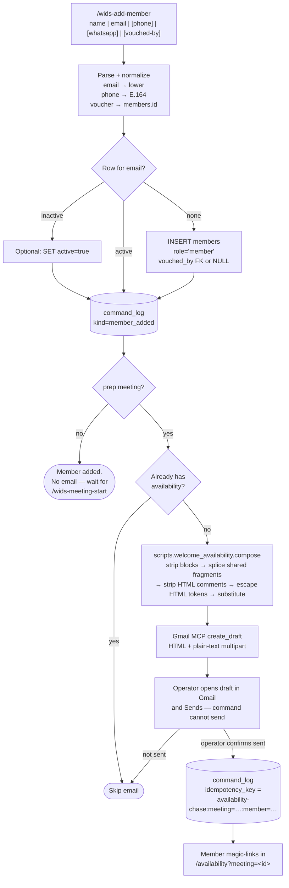

# Welcome + availability email — flow

End-to-end lifecycle for adding a member mid-cycle and drafting their
welcome-and-availability email. Use this when operating or changing
`/wids-add-member`, `scripts/welcome_availability.py`, or
`assets/emails/template/welcome-availability.{html,txt}`.

Operational steps live in
[`.claude/commands/wids-add-member.md`](../.claude/commands/wids-add-member.md).
Template matrix and token contracts live in
[`docs/runbooks/transactional-emails.md`](runbooks/transactional-emails.md).
Client-behaviour evidence (mark loss on the compose-send path) lives in
[`docs/runbooks/email-client-behavior.md`](runbooks/email-client-behavior.md).

## Intent

Someone joins between cycles. They need a roster row, an optional durable
vouch link (`members.vouched_by`), and a personal ask for availability on the
open `prep` meeting — not the lapsed-regular lede that
`availability-reminder` uses ("It's been too long").

## Flow



## Components

| Component | Role |
|---|---|
| `.claude/commands/wids-add-member.md` | Operator slash command — insert/reactivate, compose, draft, log |
| `migrations/023_members_vouched_by.sql` | Nullable self-FK `members.vouched_by` + no-self CHECK + partial index |
| `migrations/031_members_column_grants.sql` | Portal sessions can `SELECT` only `id`, `name`, `role`, `auth_user_id`. `vouched_by` / `email` / `phone` stay on the service-role client (applied 2026-08-15) |
| `assets/emails/template/welcome-availability.{html,txt}` | Template pair with `BEGIN-BLOCK` / `[[BEGIN:]]` markers; HTML hosts `__WORDMARK_BLOCK__` / `__CTA_BLOCK__` |
| `assets/emails/template/_{wordmark,cta,footer_brand}_shared.html` | Shared fragments spliced by `splice_shared_blocks()` before comment stripping |
| `scripts/welcome_availability.py` | Block composer; preview via `uv run python -m scripts.welcome_availability` |
| `scripts/quotes.py` | Rotates `quote.text` / `quote.by` when the quote block is on |
| `paper_companions.payload` | Source of truth for whether `links.companion` is live |
| `command_log` | `member_added` on insert; chase-namespace key after a real send |
| Gmail MCP `create_draft` | Draft only — no send tool |

## Block toggles

Six optional blocks, defaults all `True` in `Blocks`:

| Block | Turn off when |
|---|---|
| `vouch` | Drop the vouch **card** only. See wart below. |
| `meet_strip` | Cadence / hosts copy is wrong for this send |
| `availability` | Ask section not needed |
| `note` | Keep on for new members — deep link dies at sign-in (`web/middleware.ts` → `/`) |
| `paper_card` | No live companion: `SELECT paper_id FROM paper_companions WHERE paper_id = ? AND payload IS NOT NULL` returns nothing |
| `quote` | Skip the footer quote |

Always on (no markers): header, greeting + intro, CTA, sign-off, footer.

There is no header switch. The ceremonial "court" header was removed; court/queens voice belongs to `new-paper-announcement` only.

### Vouch wart (verified in tests)

`vouch.firstName` appears in the **preheader, intro sentence, vouch card, and footer**. Only the card sits inside the `vouch` block. `Blocks(vouch=False)` without supplying `vouch.firstName` raises `CompositionError` rather than shipping a hole — see `test_vouch_off_still_requires_the_name_and_says_so_loudly`. With no voucher, either invent operator-authored no-voucher copy for those three mid-sentence sites, or do not send this template yet.

`vouch.blurb` **is** scoped to the card: omit it when `vouch=False`.

Blurb copy depends on who is sending:

- Third-party voucher: "Grab her number before the first meeting — she's your person…"
- Voucher is the sender: "I'm your person for anything you want to ask before the first meeting."

## Constraints operators hit

- **Greeting is `Hey Queen,`** — `recipient.firstName` is accepted but unused. Middle-name mis-greeting does not apply here; it still does for `availability-reminder` / `rsvp-confirmation`.
- **Deep-link the meeting:** `links.availability` must be `<portalBase>/availability?meeting=<id>`. Bare `/availability` falls back to newest prep and can point at a rolled-over meeting.
- **HTML tokens are escaped** by the composer; the `.txt` twin is not. Do not double-escape.
- **Mark will be missing** when the operator sends from Gmail compose — verified; see `docs/runbooks/email-client-behavior.md`. Everything else survives via `bgcolor` attributes.
- **Do not log the chase idempotency key for an unsent draft.** That silences `availability-chase` for a member who never got mail.
- **Read `vouched_by` with the service-role client.** After `031`, an authenticated portal session cannot `SELECT` that column.

## Preview and tests

```sh
uv run python -m scripts.welcome_availability
uv run pytest -c tests/pytest.ini -v tests/welcome_availability_test.py
```

`render_email_previews.py` cannot drive this template — blocks must resolve first.
